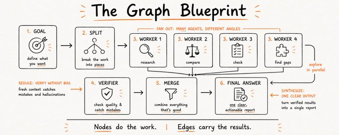
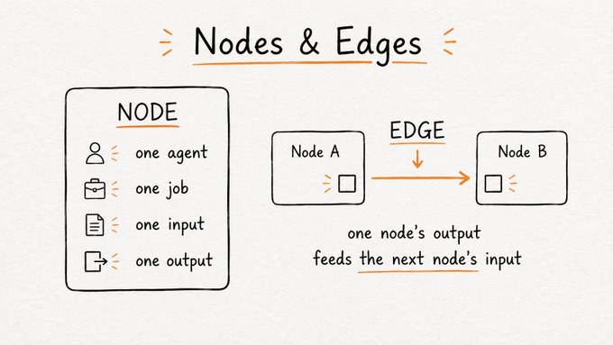
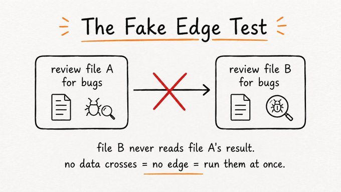
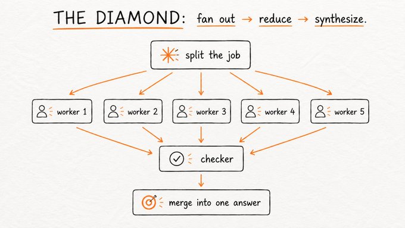

Graph Engineering explained: 
- what it is, 
- when to use it and 
- when not to
----------------------------------

source:
- https://x.com/AnatoliKopadze/status/2080668775796314331

This is the skill behind real roles at large companies. The difference between doing one job, and designing how a hundred of them get done.

### 1. What a graph actually is?
-------------------
A graph is just a plan written for your AI work, drawn out so you can see it. 

It answers 2 questions:
        
    - which jobs need to happen, and   
    - which job has to wait for which.

There are only 2 parts, and getting them straight fixes most of the confusion.

1. **A Box** is called a **Node**. 

    - It's one job: one agent doing one task, with one thing going in and one thing coming out. 
    - for instance, Researching a competitor. Writing a draft. Checking a claim.

2. An **Arrow** is called an **Edge**. 
    
    - here, one job's(Job A) input requires another job's (Job B) output, so it has to wait for it.
    - arrow only counts when something real actually passes along it.




    Nodes do the thinking.  
    Edges carry the results. 

The thing that makes a node actually usable in a graph is a contract: 
    - one bounded job, 
    - a defined input, 
    - a defined output. A node whose output is a fixed output shape where next node can consume without guessing.

For Instance...

```


▸ NODE CONTRACT
JOB:     research one competitor's pricing (one job, nothing else)

IN:      { competitor: "name", url: "https://..." }   ← passed in, never assumed

OUT:     { price: number, plan: string, source: url, date: "YYYY-MM-DD" }

SCHEMA:  enforced. if the agent returns free text, it's rejected and retried

WHY:     a defined output is what lets the next node read this one without a human in the middle. that is what makes it wire-able.

```

### 2. The Test that finds the fake edges.
--------
Look at the AI workflow you run today and walk it step by step. At each step, ask one thing: does this step actually need the result of the one before it?

If yes, the edge is real. Keep the order. If no, there is no edge, and the wait is wasted.



```
    Take a simple one: 
    
    "review file A1 for bugs, then review file B1 for bugs." It reads like a sequence, but the check on file B never looks at what file A returned. 
    
    They only run one after another because that is the order you typed them in. 
    
    Run them side by side and the whole thing finishes in the time of the slower single file, not the two added together.

```

### 3. Your current setup is already a graph.
-----------------------
When you write an agent as "do A, then B, then C, then D," you have technically already drawn a graph. It is just the saddest possible one: a single straight chain where every node has one arrow in and one arrow out.

It runs correctly. It also runs slowly and breaks easily, because a chain has no redundancy. If C stalls, D never happens, and A's work is trapped upstream with nowhere to go.

The first real skill of graph engineering is redrawing that chain. Take your linear workflow, and for each arrow, ask the fake-edge question. Cut the arrows that carry no data

### 4. The one pattern that pays: the diamond.
-----------------------
The work should split, several workers dig side by side, something checks what they found, and everything merges back into one answer.

That picture is called the diamond, and it is close to the only pattern you need. Its formal name is worth memorizing: fan out, reduce, synthesize.




Here is what the diamond actually looks like under the hood. When you say "workflow," Claude writes a short script like this itself and runs the coordination as code, which is why passing results between agents costs zero extra context.

```
// a market-scan graph — the diamond, written by Claude when you say "workflow"

const angles = [
  "pricing vs the top 3 competitors",
  "what buyers complain about in reviews",
  "the feature gaps in the category",
  "where the market moves in the next 12 months",
];

// FAN OUT — one researcher per angle, all at the same time
const raw = await parallel(
  angles.map(a => () => agent({
    task: `research: ${a}. every claim needs a source url + date.`,
    schema: Finding,        // validated output, not free text
    model: "cheap",         // boring node → cheap model
  }))
);

// REDUCE — plain code, no model, no tokens
const findings = dedupeBySource(raw.flat().filter(Boolean));

// VERIFY — a FRESH skeptic per finding, tries to kill it
const survivors = await parallel(
  findings.map(f => () => agent({
    task: "try to disprove this. return keep | drop + why.",
    input: f,
    freshContext: true,     // never reuse the researcher's chat
    model: "strong",        // judgment node → strong model
  }))
).then(v => findings.filter((_, i) => v[i].verdict === "keep"));

// SYNTHESIZE — one agent writes the answer from what survived
return agent({ task: "one report, ranked by confidence, sources attached.", input: survivors, model: "strong" });

```

### 5. The checker is the whole trick.
----------------

now You put a separate node on the edge. Its only job is to try to kill the finding before it moves on. If it survives, it passes. If not, it dies right there.


