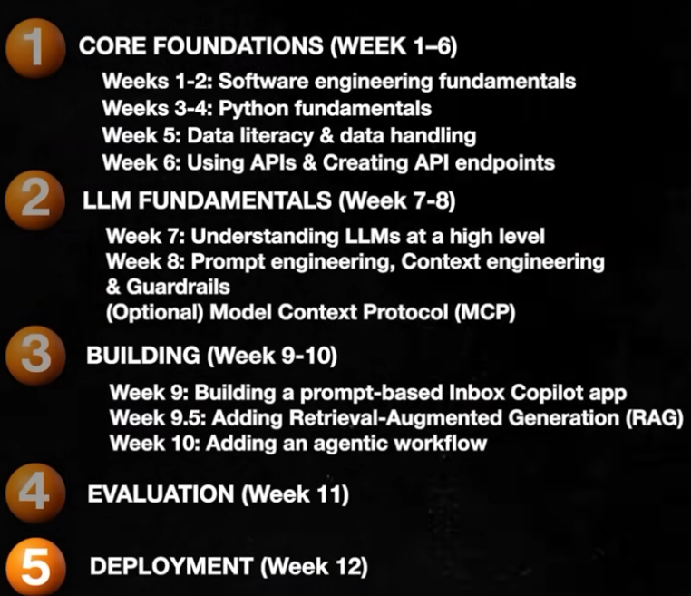

Complete Learning Roadmap for Building AI Apps

source: https://www.youtube.com/watch?v=6mCTdjlI2zI

Build AI apps from Idea to Deployment
-------------------------

There are 5 stages

1. Core Foundations
2. LLM fundamentals
3. Building apps(from simple to Advanced)
4. Evaluation
5. Deployment

Picture depicting 5 stages

    

1. Core Foundations
- Core Engineering & Python foundations

