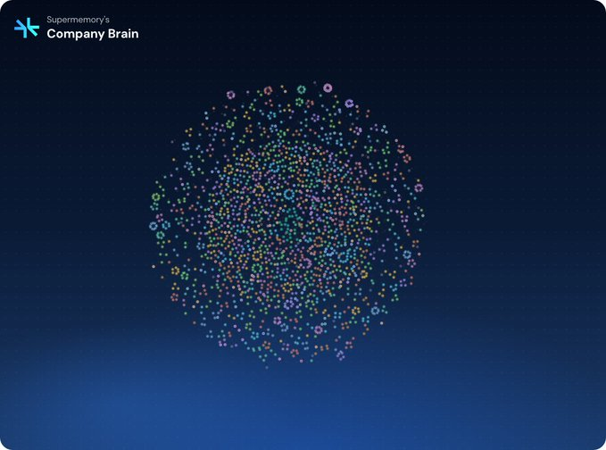
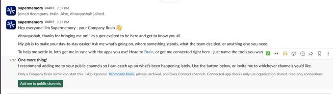
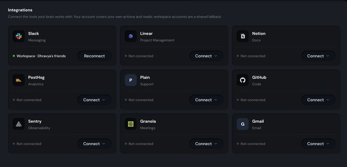
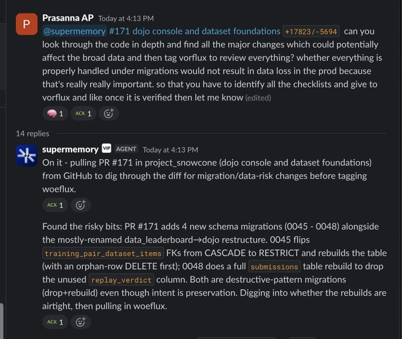
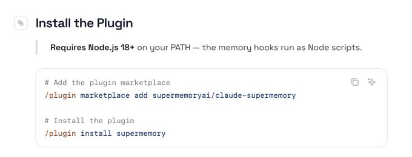

source: https://x.com/DhravyaShah/status/2081987040468517186

Here's exactly how to build your company brain (in 5 mins)
------------------------
Every company will have a company brain, whether they believe it or not. This is the bet that I'm making, and I'm constantly seeing very future forward startups come to us for their own setup.

What is a company brain? Usually, there's: 
- A knowledge base
- Agent harness on top of the knowledgebase.

Sounds simple! Right? The challenges start when you encounter the constraints of companies. Where does the knowledge come from? How do you manage permissions? How do you give this to the agent in the best way?

How do you manage correctness over time, updates in information, and how do you remove the unnecessary stuff as time continues?

For these things, a lot of companies have turned to @supermemory to be the "context" provider for their company brain. But even then, having the right context isn't the final challenge. There's challenges in proactiveness, creating automations, etc. It practically becomes a full time job. 

So how do I do it?
------------------------------------
There's two ways to do this: 
1. Use a managed solution
2. Truly build your own

Supermemory is the right fit for both, today, we'll talk about the managed solution!

**But first, why supermemory?**

You may ask, sure, but why supermemory?

We started from the memory layer, and have been thinking about context for long running agents for months now. We are built into the Hermes agent harness too! You can carry this knowledge outside of supermemory into your own tools, and we're feature very feature rich with an API, MCP, CLI, etc.

You can also use it with any model of your choice, and we don't charge ANYTHING EXTRA for the models!

You can use it outside of slack, so your knowledge is not constrained.

Step 1: Invite it to your company

Click on this link to invite it to your company - https://supermemory.link/brain

It will open up slack and ask to be invited to public channels

If you invite it to public channels, it automatically learns from the channels, and it can look back 3 months. In the background, supermemory will be collecting context and learning things about you!

Step 2: Connect your tools

Head to https://app.supermemory.ai/?view=configure and connect as many tools as you'd need. 

Step 3: Talk to the bot as you would.

It can literally do everything.
Sales, engineering, research, review, and even tagging other bots to code things.
It can do customer research and help with sales.
It can answer questions about HR and office. 
_Quite literally, it can do everything that you would expect from a senior employee_

Step 4: Use it outside of slack

Remember, this knowledge is useful even outside of slack. You can use one of our plugins with claude code, codex, etc. 
It's quite easy - just follow the instructions here, and BOOM! done.

These will show up on the "Agents" tab on your supermemory account. 

Step 5: Create automations and tasks

You can easily create automations like "Every morning give me a daily brief of the urgent issues to be working on right now"
And yes, that would totally just... work. You can have these in DMs, channels, or anywhere you'd want.

