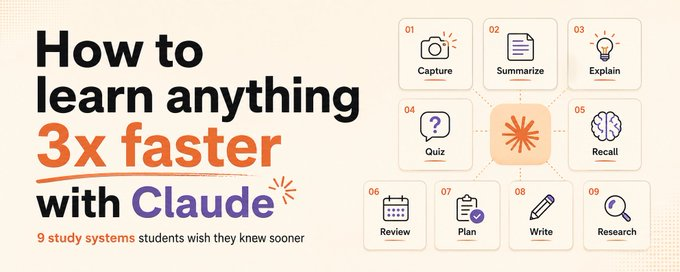
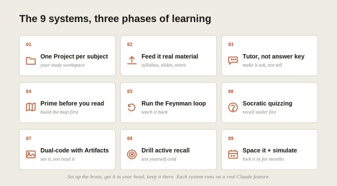
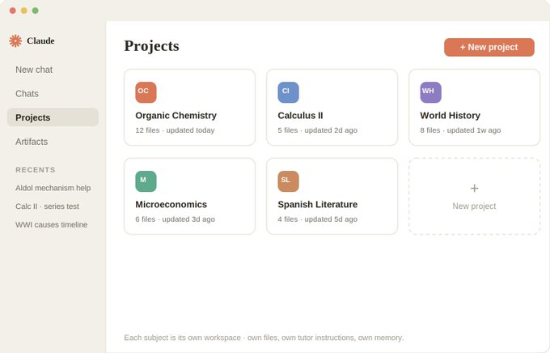
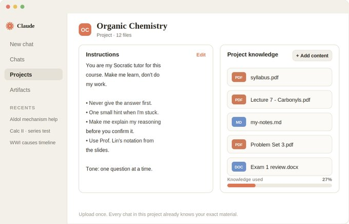
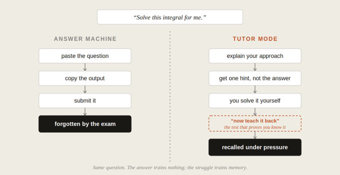
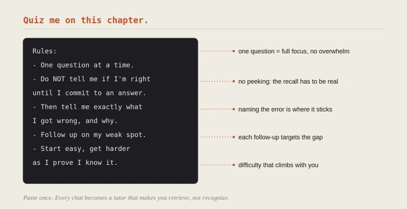
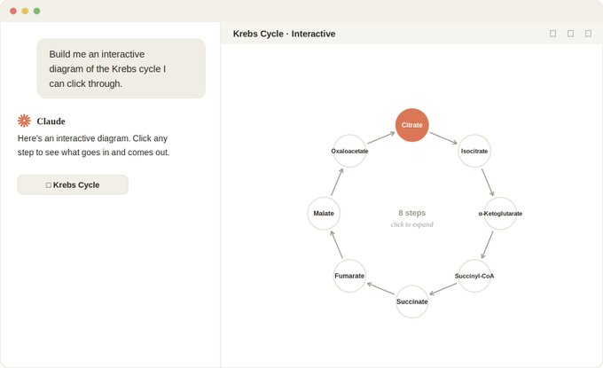
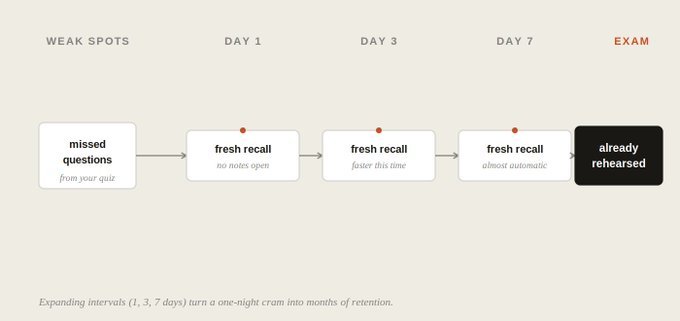

Reference: https://x.com/0xMorlex/status/2063238361926496345

How to learn anything 3x faster with Claude: 9 study systems students wish they knew sooner
--------------------------------



### 9 systems. 3 parts. One tutor that fits in your pocket.



PART 1 · Set Up Your Study Brain
------------------------------------------
**01. Give each subject its own Project.**

The single biggest mistake students make is running every subject through one endless chat. Organic chemistry, macroeconomics, and your history essay all bleed into the same context, and Claude loses the thread of each.

A Project is a self-contained workspace with its own chat history, instructions, and uploaded knowledge. Create one per course: Organic Chemistry, Calc II, World History. claude.ai → Projects → New Project. Free users get five; paid users get unlimited.

The rule for what earns a Project: if it has its own material, its own exam, and its own vocabulary, it gets its own workspace. Now every chat inside "Organic Chemistry" already knows your syllabus, your professor's notation, and where you left off last week, without you re-explaining.

- One per course, not one per topic. "Organic Chemistry" is a Project. "Reaction mechanisms" is a chat inside it.
- Archive after finals. Keep 3 to 7 active. A dead Project from last semester just adds noise.
- Don't dump everything in a mega-Project called "School." That defeats the entire point. The value is keeping Claude focused on one subject at a time.




**02. Feed it the real material.**

Below the instructions sits the knowledge base. Hit + and drop in the actual stuff your exam comes from: the syllabus, lecture slides, textbook chapters (PDF), past problem sets, your own messy notes. Once uploaded, every chat in that Project can use it, no re-attaching.

This is the difference between a generic tutor and your tutor. Ask "explain enthalpy" and you get a textbook answer. Ask it inside a Project loaded with your professor's slides and you get the explanation that matches the notation, depth, and emphasis you'll actually be tested on.

#### Upload the syllabus first. 
    It tells Claude what's in scope, what's not, and when each exam hits, so it never wastes your time on chapters you don't need.

#### Upload your own notes, even bad ones. 
    Claude can find the gaps in them: "Compare my notes to the slides. What did I miss or get wrong?"

#### Keep it lean. 
    A focused 5 to 10 file base beats a 50-file dump. Bloated knowledge dilutes what Claude retrieves and eats the context window your actual studying needs.




#### 03. Make Claude a tutor, not an answer key.

This is the system that separates students who learn from students who just submit. By default, Claude is helpful, which means it hands you the answer. For learning, that's exactly wrong. The answer is the part your brain is supposed to generate.

Every Project lets you set instructions that load at the start of every chat. Use them to lock Claude into tutor mode: 

**Every Project lets you set instructions that load at the start of every chat. Use them to lock Claude into tutor mode:**

```
# Role
You are my Socratic tutor for this course. Your job is to make
me learn, not to do my work.

# Hard rules
- Never give me the final answer first. Ask me what I think,
  then guide me with hints and questions.
- When I'm stuck, give ONE small hint, not the solution.
- Make me explain my reasoning out loud before you confirm it.
- If I ask you to "just give me the answer," push back once,
  then show the method, not the plugged-in number.

# Style
- One question at a time. Wait for my answer.
- Point out exactly where my logic breaks, not just that it's wrong.

```
Write this once per Project. From now on, every conversation starts as a tutor that refuses to let you coast. If you find yourself begging Claude for the answer, that's the friction doing its job. That struggle is the moment memory forms.




PART 2 · Learn It Faster
------------------------------------
04. Prime before you study.

Walking into a lecture or a chapter cold is the slowest way to learn. Your brain has no hooks to hang the new information on. The fix is a 5-minute primer that builds the map before you fill it in.

Before you read, ask: 

```
Before I read Chapter 7, give me a one-page map:
- The 5 core concepts and how they connect
- The single hardest idea most students trip on
- The 4 questions I should be able to answer when I'm done
Don't explain them yet. Just the map.
```
Now you read looking for answers, not just letting words wash over you. Reading with questions in mind turns passive reading into a search, and searching is active, which means it sticks. You'll get through the same chapter faster and remember more of it.


**05. Run the Feynman loop.**

The fastest way to find out what you don't understand is to try to teach it. Named after physicist Richard Feynman: if you can't explain it simply, you don't actually know it. Claude makes this a live loop instead of a solo exercise.
Pick a concept and explain it back to Claude like you're teaching a 12-year-old:

```
I'm going to explain how the Krebs cycle works, in plain language.
Your job: stop me the moment I'm vague, hand-wavy, or wrong.
Ask me to clarify exactly that point. Don't explain it for me.
Make me find the words.
```
Every time it stops you is a gap you didn't know you had. The struggle to put it in your own words is the encoding, far stronger than re-reading, which only builds false confidence. Loop until you can explain the whole thing without a single interruption. That's mastery, measured.


**06. Use Socratic mode. Make it ask, not tell.**

Re-reading your notes feels productive and teaches almost nothing. Your eyes recognize the words and your brain mistakes recognition for knowing. Active recall (pulling the answer from memory) is the most validated study technique there is, and it's the exact opposite of re-reading.

Turn Claude into the thing that forces recall:

```
Quiz me on this chapter. Rules:
- One question at a time.
- Do NOT tell me if I'm right until I commit to a full answer.
- After I answer, tell me exactly what I got wrong and why.
- Then ask a follow-up that targets my weak spot.
- Start easy, get harder as I prove I know it.
```

The discomfort of being asked something you half-know is the entire point. It's called a desirable difficulty, and it's where the learning happens. A tutor that tells is a textbook. A tutor that asks is a teacher. Set Claude to ask.




**07. Dual-code it with Artifacts.**

Your brain stores a picture and a word better than two words. It's called dual coding, and most students never use it because drawing the diagram themselves takes too long. Claude builds it for you in seconds, not a description of the diagram but the actual diagram.

Whenever a concept is spatial, sequential, or has moving parts, ask for an Artifact:

- Diagrams. "Build an SVG flowchart of how a bill becomes law." Renders in the side panel, scales cleanly, edits by request.
- Interactive widgets. "Build a React simulation of supply and demand where I can drag the curves and watch price change." You play with the concept instead of reading it.
- Timelines and concept maps. "Map every event leading to WWI and how they're causally connected." Seeing the connections is the learning.


The trick that unlocks this is to name the format explicitly. "Build me an interactive React diagram of X" produces a working visual; a vague "visualize X" often just produces text. Tell it the deliverable, and you get something you can click, edit, and screenshot into your notes.





PART 3 · Make It Stick
------------------------------------
**08. Drill active recall on demand.**

A primer gets it in. The Feynman loop confirms it's in. This is where you prove it stays in, by generating real tests from your own material and taking them cold, no notes open.

```
From my uploaded notes and slides, generate a 20-question test:
- Mix recall ("define X"), application ("solve this"),
  and explanation ("why does X cause Y?")
- Match the difficulty and style of my professor's slides
- Don't show me any answers until I've finished all 20
- Then grade me and group my mistakes by topic
```
That last line is the gold. You don't just get a score. You get a map of exactly what to study next. The questions you miss aren't failures; they're your study list for tomorrow, handed to you for free.

**09. Schedule spaced repetition and simulate the exam.**

You forget most of what you learn within days unless you revisit it. But revisit it at expanding intervals (1 day, 3 days, 7 days) and it locks in for months. That's spaced repetition, and it's the closest thing to a cheat code that learning science has.

Two systems run it:

**Flashcards on tap**. "Turn my weak topics from the last quiz into 30 flashcards: question on one side, answer plus a one-line why on the other. Export as a list I can paste into Anki." The deck builds itself from the exact things you got wrong.

**A review schedule**. Ask Claude to lay out what to re-test on which days before the exam, weighted toward your weak spots. On paid plans you can even use Routines to have it surface a fresh quiz each morning automatically.

Then, the week before the exam, run the simulator:
```
Build me a full practice exam in my professor's format and timing.
I'll answer it under exam conditions. Then grade it like the
professor would, show me where I lost points, and give me a
focused 3-day plan to fix exactly those gaps.
```

You walk into the real exam having already taken it. No surprises left, just the version you've already practiced.




### The habits that keep students learning the slow way

**Asking Claude for the answer instead of the method**. You get the grade and keep nothing. The thinking you skipped was the learning.

**One endless chat for every subject**. No Projects, no separation, context bleeding everywhere.

**Re-reading notes and calling it studying**. Recognition isn't recall. If you didn't pull it from memory, you didn't practice the thing the exam tests.

**No uploaded material**. A generic tutor instead of one that knows your exact syllabus and notation.

**Cramming once instead of spacing it out**. What you learn tonight is mostly gone by Friday unless you revisit it.

**Reading concepts you could have seen**. Skipping diagrams and simulations wastes the strongest memory channel you have.

**Never simulating the exam**. Finding out the format and timing on test day instead of three rehearsals earlier.


**Conclusion**

The fast learners aren't smarter. They just stopped using Claude as an answer vending machine and started using it as a tutor that makes them do the hard part: the recall, the explaining, the catching of their own gaps. That's the whole difference.

Every system here is one Project, one instruction, or one prompt away. None of it costs more or requires code. The chatbot that does your homework leaves you exactly where you started. The tutor that refuses to do your homework is how you learn anything 3x faster.

Pick the one system you're missing most, probably the tutor instruction or active recall, and run it on whatever you're studying tonight. Then the next. The students pulling ahead just started.


