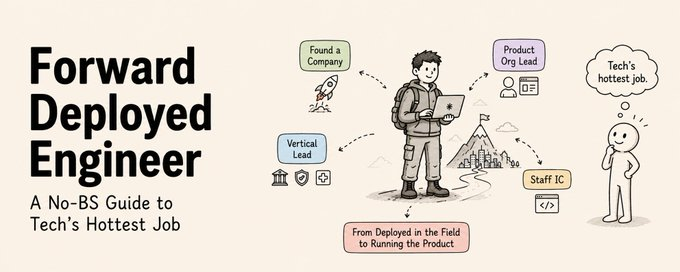
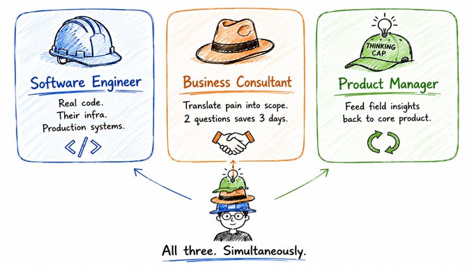

# Forward Deployed Engineer: A No-BS Guide to Tech's Hottest Job

Source: [@sairahul1](https://x.com/sairahul1/status/2083445852027392195)

## What an FDE actually does

Palantir's internal definition nails it:

"FDE responsibilities look similar to those of a startup CTO: you work in small teams and own end-to-end execution of high-stakes projects."

You wear three hats simultaneously.

**Hat 1: Software engineer**

**Hat 2: Business consultant**

**Hat 3: Product manager**

#### Hat 1: Software engineer
-----------------------
You write real code. On their infrastructure. With their tooling.

#### 2: Business consultant
-----------------------
You understand their domain, map their processes, translate business pain into technical scope.

#### Hat 3: Product manager
-------------
You feed real-world pain of customer facing back to your company's core product team

The result: you are a founding CTO embedded inside someone else's company, with the full engineering resources of your own company behind you.

## Skills that actually matter
They are the ones who can hold six domains in their head at once and switch between them without friction.

The technical floor:

→ **Python and TypeScript** — covers almost everything you touch.

→ **One cloud** — whichever your target customers actually run 

→ **One database** you can debug at 2am in a stranger's environment 

→ **Enough frontend** to ship a usable interface in a day

You may need to be the only person in the room who can do all of it.

