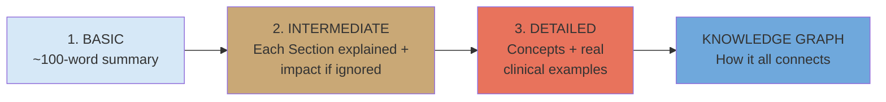
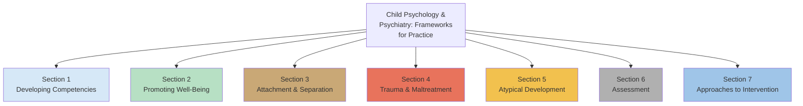
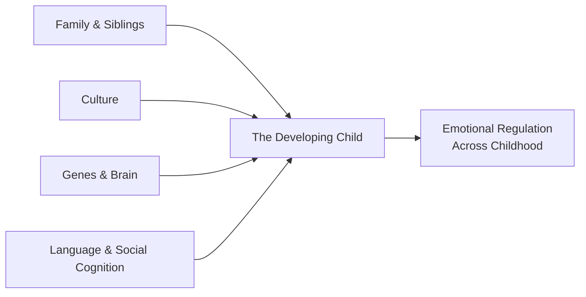
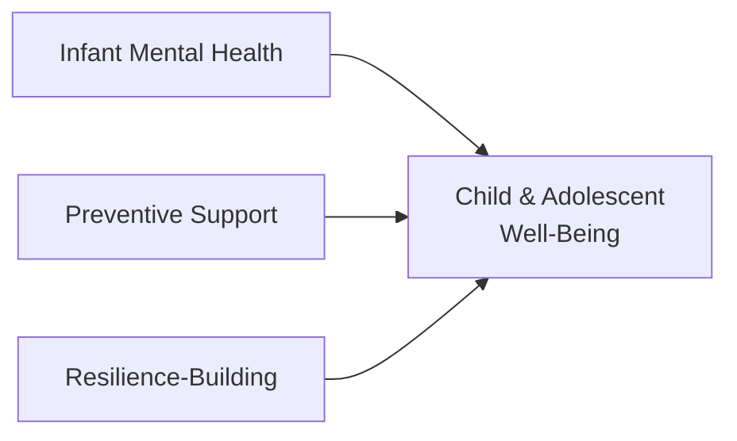
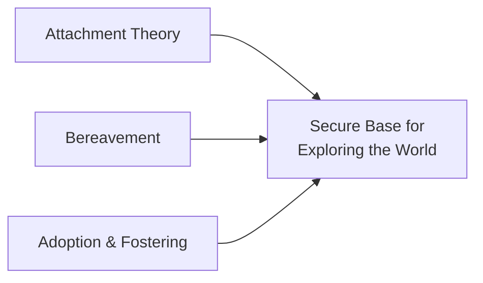
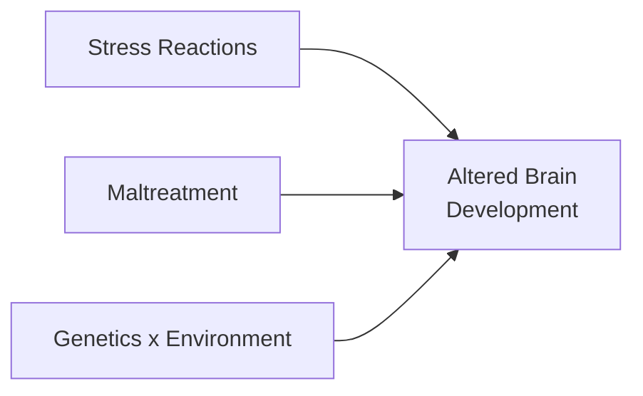
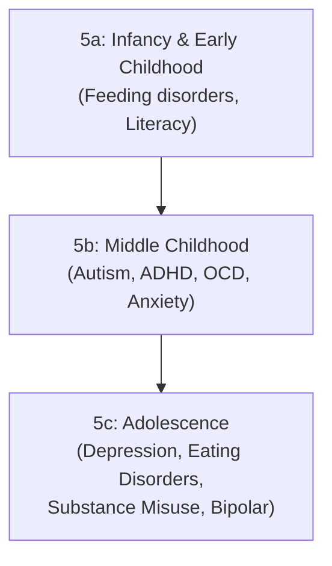
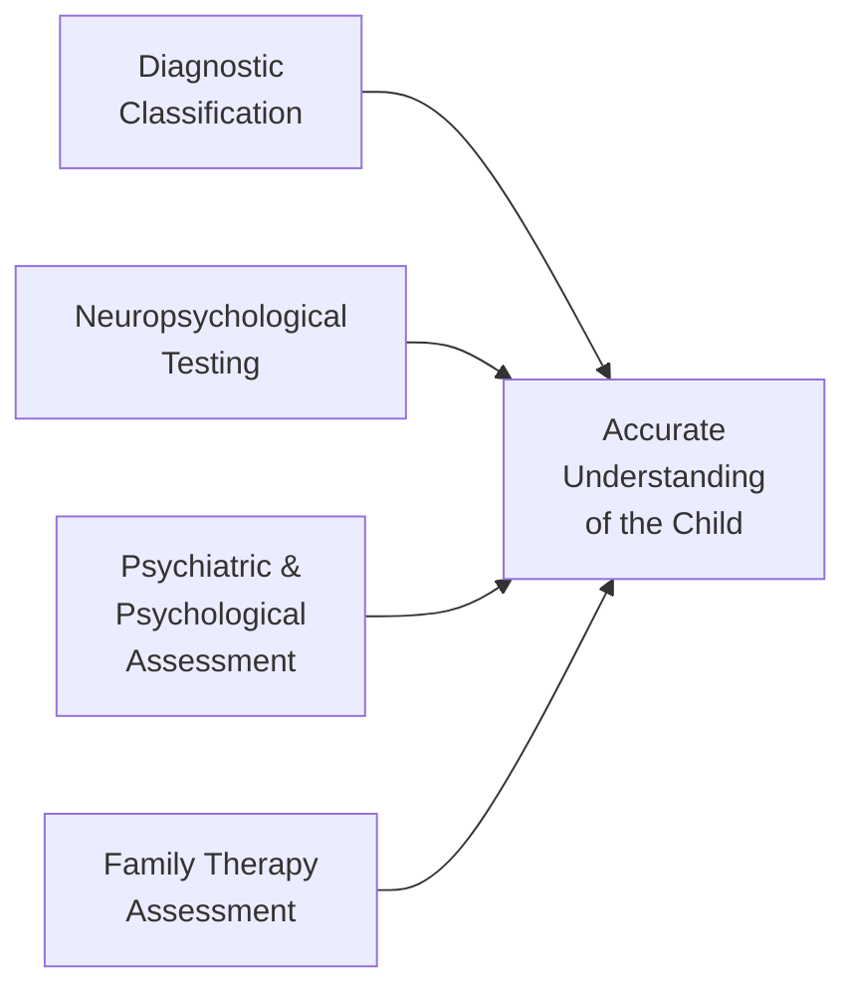
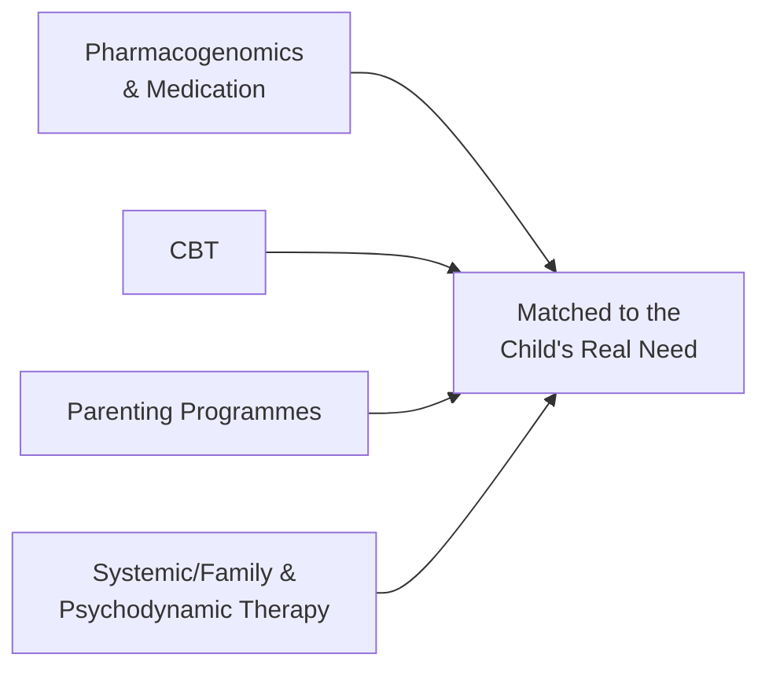
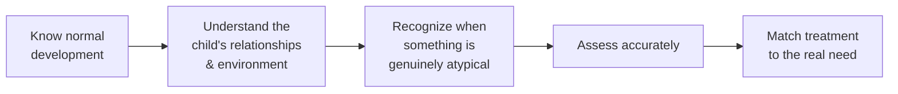

# Child Psychology and Psychiatry — Your 30-Minute Guide

### Based on *Child Psychology and Psychiatry: Frameworks for Practice* (2nd Edition), edited by David Skuse, Helen Bruce, Linda Dowdney & David A. Mrazek

> **A note on what this book actually is:** despite a filename that suggests a general parenting book, this is a 46-chapter clinical and academic textbook written by child psychiatrists, psychologists and researchers, for professionals (trainee clinicians, paediatricians, psychiatrists, psychologists) working with children. It is a *reference framework*, not a parenting-advice manual. This guide treats it honestly as that — a map of how professionals understand child development, distress and treatment — organized around its **7 Sections**, the way the Money Rules guide was organized around 5 Parts and the Full Voice guide around 3 Parts.

---

## How This Guide Works



---

## PART 1: BASIC SUMMARY (≈100 words)

This textbook maps how children develop — socially, emotionally, cognitively — and what happens when that development is disrupted. It moves through seven territories: the everyday building blocks of a child's competence (family, culture, genes, language, social cognition); how to actively promote well-being and resilience; the bond between child and caregiver (attachment, loss, adoption); the damage done by trauma and maltreatment; the disorders that can emerge (autism, ADHD, anxiety, depression, eating disorders); how professionals assess a child; and, finally, the treatments — medication, therapy, parenting programmes — that help. The throughline: development is shaped by the constant interaction of biology, relationships and environment, and difficulties are best understood, not just labelled.

---

## PART 2: INTERMEDIATE — The 7 Sections Explained



### Section 1 — Developing Competencies



This section is the foundation: it lays out *normal* development so that later sections' descriptions of atypical development make sense. It covers how families and siblings shape a child, how infants read faces and develop fear responses, how genes and environment jointly build the brain, how language and "theory of mind" (understanding that other people have their own beliefs and feelings) emerge, and how emotional regulation matures from infancy's simple self-soothing into adolescence's complex, self-aware coping strategies.

**Impact if this Section's lessons are ignored:** Without understanding what normal development looks like at each age, it becomes impossible to recognize when something is genuinely wrong versus developmentally typical (e.g., mistaking normal "terrible twos" irritability for a disorder, or missing a real delay because "he'll grow out of it"). Clinicians (and parents) who skip this foundation either over-pathologize ordinary childhood or under-react to real delay.

### Section 2 — Promoting Well-Being



Rather than waiting for problems to appear, this section is about proactive mental-health promotion: supporting infant mental health before problems take root, building general well-being programmes for children, and specifically fostering resilience in adolescents — including giving young people real ownership, power and decision-making roles rather than just "protecting" them.

**Impact if ignored:** Mental health systems that only react to crises, rather than investing in prevention and resilience, miss the cheapest and most effective window for intervention — and adolescents who are only ever "done to" rather than given agency in their own care tend to disengage from support altogether.

### Section 3 — Attachment and Separation



This section covers the emotional bond between a child and caregiver — how it forms, how it's measured (the famous "Strange Situation"), what happens when it is disrupted by death, and what happens when children must form new bonds through adoption or fostering.

**Impact if ignored:** Insecure or disorganized attachment is one of the most consistently replicated predictors of later emotional, behavioural and social difficulty. Ignoring attachment quality means missing the single most useful lens for understanding *why* a child behaves as they do around trust, comfort-seeking and relationships — and it means bereaved or adopted children's grief and identity questions go unaddressed until they surface as bigger problems.

### Section 4 — The Impact of Trauma and Maltreatment



This section is sobering: it shows, with brain-imaging evidence, exactly how chronic stress and maltreatment physically change a developing brain — smaller cerebellum volume, altered amygdala reactivity, disrupted white-matter tracts — and how genetic variation (like the *MAOA* gene) interacts with maltreatment to make some children far more vulnerable than others to the same adversity.

**Impact if ignored:** Treating a maltreated child's difficult behaviour as simple "naughtiness" rather than an adaptive (if maladaptive-looking) response to a threatening environment leads to punishment-based approaches that make things worse. It also means missing that a child's brain may be in a genuinely different, hyper-vigilant operating mode — not being deliberately difficult.

### Section 5 — Atypical Development



The largest section (14 chapters): the specific disorders that can emerge at each life stage, from feeding and reading difficulties in early childhood, through the middle-childhood disorders most people have heard of (autism, ADHD, OCD, anxiety), to the adolescent-onset conditions (depression, eating disorders, substance misuse, bipolar disorder, emerging personality disorder).

**Impact if ignored:** Every disorder in this section has a proven "window" — earlier recognition means simpler, shorter, more effective treatment (OCD, for instance, takes an average of 12 years to reach diagnosis in adults who had it since childhood). Ignorance here means years of unnecessary suffering and entrenchment of problems that were once quite treatable.

### Section 6 — Assessment



This section is the toolbox: how clinicians systematically figure out *what* is going on — diagnostic classification systems (and their genuine limitations), neuropsychological testing, structured psychiatric and psychological assessment, and assessing the family system itself, not just the individual child.

**Impact if ignored:** Treatment without accurate assessment is guesswork. A child medicated for ADHD who actually has an anxiety disorder, or a "behaviour problem" that is really an undiagnosed learning disability, will not improve — and may be harmed — until proper assessment identifies the real issue.

### Section 7 — Approaches to Intervention



The final section: what actually helps, once a child is accurately understood — from cutting-edge genetic testing that predicts medication response, through cognitive-behavioural therapy, parent-training programmes for conduct problems, to systemic family therapy and psychodynamic approaches.

**Impact if ignored:** Even a correct diagnosis is useless without matching the right intervention to the right child and family. One-size-fits-all treatment (e.g., medication alone, with no behavioural component) consistently underperforms combined, tailored approaches across nearly every disorder this book covers.

---

## PART 3: DETAILED — Concepts Explained with Examples

### Section 1 in Depth: The Building Blocks

**Language development** follows a strikingly consistent path: by 10 months, the average receptive vocabulary is about 50 words; by 18 months, expressive vocabulary hits roughly 85 words, and by 24 months, around 300 words for the average American toddler (with big individual variation — from 7 to 668 words at 24 months in one study). "Late talkers" — 2-year-olds with small vocabularies — are identifiable early, and while 60–70% catch up on their own, 30–40% will not, so a parent's concern about late talking is worth taking seriously rather than dismissing with "boys talk later."

**Theory of mind** (understanding that other people have separate beliefs, even mistaken ones) develops in a predictable sequence tracked by a 6-test scale: children pass "diverse desires" (different people like different things) at nearly universal rates (95% of 3–6 year-olds), but "sarcasm" (people sometimes say the opposite of what they mean) is passed by only 20%. Interestingly, children who are good at reading others' minds are not automatically "nicer" — the same skill that produces empathetic, well-liked children can also produce highly effective bullies, who use their social intelligence manipulatively.

**Emotional development in middle childhood** (Table 10.1 in the book) shows a clear arc: an infant relies on a caregiver's "scaffolding" to self-soothe; a toddler shows irritability when limits are placed on their autonomy (the "terrible twos"); a preschooler starts using pretend play and language to manage feelings; and by middle childhood (6–12), children can distinguish between genuine emotional expression with close friends and "managed display" with others — essentially learning to perform socially appropriate emotions even when they don't feel them internally.

### Section 3 in Depth: Attachment, Loss, and New Families

**The Strange Situation**, developed by Mary Ainsworth, remains the gold-standard way of studying infant attachment. A parent and 11–18-month-old infant are observed through brief separations and reunions with a stranger present. About 65% of infants show **secure** attachment (distressed at separation, but easily comforted and able to return to play at reunion). The insecure types are **avoidant** (15%, ignores the caregiver at reunion), **resistant/ambivalent** (10%, angry and inconsolable at reunion), and **disorganized** (15%, shows contradictory, freezing, or fearful behaviour) — this last type is the one most strongly linked to maltreatment, because the child's caregiver is simultaneously their source of comfort *and* their source of fear, creating an unsolvable approach-avoidance conflict.

One landmark intervention study (van den Boom) randomly assigned 100 highly irritable newborns to a treatment group receiving home visits focused on maternal sensitivity, versus a control group. The treatment produced large, lasting improvements in attachment security still measurable 3.5 years later — direct experimental proof that sensitive caregiving *causes* secure attachment, not just correlates with it.

**Bereavement** in children looks different by age: preschoolers believe death is reversible and may ask when the dead parent is "coming back"; by age 7, children understand death is permanent; by age 11, the concept is fully adult-like, sometimes bringing existential questions about fairness and meaning. A key finding for any adult supporting a grieving child: only about one in five bereaved children shows clinically significant disturbance — grief itself is not pathology, and most families need understanding and normalization far more than professional therapy.

**Adoption and fostering** raises two recurring themes for children: "who were my birth parents, and what were they like?" and "why was I given up?" Children often develop an unspoken belief that something was wrong with *them* that caused the rejection — a belief adoptive parents need to actively and repeatedly counter, not just address once. Maltreated children who move into loving adoptive homes can still "push the buttons" of their new parents in ways that replay old attachment patterns — this is not the adoptive family failing, but the child's old internal working model of relationships still operating.

### Section 4 in Depth: How Maltreatment Physically Shapes the Brain

This is one of the book's most striking sections. Structural brain-imaging studies consistently show **reduced cerebellum volume** in maltreated children and adolescents, and **increased amygdala reactivity** to threatening faces — the brain's fear-detection centre becomes hyperactive and hypervigilant, exactly what you'd expect from a brain that adapted to a genuinely unpredictable, threatening environment. This isn't damage in a simple sense — it's the brain's threat-detection system doing exactly its evolutionary job, "programmed" or "calibrated" for a hostile world, which then becomes maladaptive once the child is in a safer setting (e.g., a classroom) where hypervigilance isn't needed and instead causes problems.

The **gene-by-environment interaction** research on the *MAOA* gene is a landmark example of how genetics and environment aren't separate stories. Children who inherit the low-activity variant of *MAOA and* experience maltreatment show sharply increased risk of antisocial and aggressive behaviour — but children with the *same gene variant* who are *not* maltreated show no such elevated risk. Neither genes nor environment alone tell the story; it's the interaction that matters, and this cuts both ways — positive environmental factors, like a strong relationship with a supportive caregiver, can be protective even for genetically "high-risk" children.

### Section 5 in Depth: When Development Goes Off-Track

**ADHD** is diagnosed based on three clusters of symptoms — hyperactivity (fidgeting, running/climbing excessively, always "on the go"), inattention (fails to sustain attention, loses things, seems not to listen), and impulsivity (blurts out answers, interrupts, can't wait a turn) — with onset required before age 7 and genuine impairment across settings. It's highly heritable (around 80%, similar to autism). Treatment follows a clear decision algorithm: preschoolers start with behavioural parent-training rather than medication; school-age children with significant impairment typically add stimulant medication (methylphenidate or dexamfetamine, titrated up from a low starting dose) or, second-line, the non-stimulant atomoxetine — but the best evidence (the large Multimodal Treatment Study) found that combining medication with behavioural treatment allowed lower medication doses and better outcomes than medication alone.

**OCD** in children is described as "the hidden problem" because children often recognize their obsessions and compulsions are excessive but hide them out of embarrassment — the average diagnostic delay is over 3 years in children (12 years in adults who had childhood-onset OCD). The book describes a "vicious cycle": an obsession creates anxiety, a compulsion is performed for temporary relief, but this only reinforces the cycle by teaching the brain that the compulsion is necessary to reduce anxiety. Treatment reverses this directly through **exposure and response prevention (ERP)** — a form of CBT where the child faces the feared situation while resisting the urge to perform the compulsion, learning experientially that anxiety decreases on its own even without the ritual. A helpful technique is "externalizing" OCD — treating it as an "intruder" the child and family can name and fight together, rather than a part of the child's identity.

**Literacy disorders (dyslexia)** affect 3–6% of children and are now understood as dimensional (a spectrum, not a strict category) rather than all-or-nothing. Critically, the book distinguishes children with word-recognition problems (classic dyslexia, rooted in difficulty processing speech sounds — such children struggle to read invented nonsense words like "kig" or "ploob") from children with reading *comprehension* difficulties who can decode words accurately but fail to extract meaning — a separate, often-missed group sometimes called "hidden" poor comprehenders because their fluent-sounding reading masks the problem.

### Section 7 in Depth: What Actually Works

**Psychiatric pharmacogenomics** is presented through a vivid, cautionary case: a 9-year-old boy treated with fluoxetine for OCD died of a cardiac arrest after developing status epilepticus; autopsy revealed he had two inactive copies of the *CYP2D6* gene, meaning he could not metabolize the drug, leading to toxic serum levels. Genetic testing before prescribing can now identify "poor metabolizers" (roughly 10% of patients of European ancestry) and "ultra-rapid metabolizers" who process drugs too fast to reach therapeutic levels — even affecting breastfeeding infants, since a mother who is an ultra-rapid metabolizer of codeine can produce dangerously high morphine levels in her breast milk.

**Cognitive-behavioural therapy (CBT)** rests on the idea that anxious children interpret ambiguous situations as threatening, aggressive children interpret them as hostile, and depressed children selectively attend to negative features of events — and that changing these automatic interpretations changes behaviour and feeling. A simple illustration from the book: if a party guest is 30 minutes late, an anxious child assumes "nobody wants to come" and does nothing but feel upset; an aggressive child assumes "nobody wants to come" and gets angry at the guest later; a typically-developing child assumes "there's probably traffic" and calls to check. CBT teaches children to notice, question, and replace the anxious/aggressive interpretation before it drives behaviour. Large trials (like the TADS depression study) found CBT combined with medication outperformed either alone, and importantly, CBT-only patients showed far lower rates of suicidal thoughts (6%) than medication-only patients (15%).

**Parenting programmes for conduct problems** are built on decades of social-learning-theory research and follow a strikingly consistent format: parents are taught to follow the child's lead in play rather than direct it, to describe and praise the child's behaviour specifically ("you're really making that tower tall") rather than vaguely, to give clear, single, forceful commands instead of a stream of nagging demands, and to apply calm, immediate, consistent consequences (like time-out) rather than empty threats. Programmes typically run 8–12 structured sessions and show effect sizes of 0.4 to 1.0 — genuinely large, reliable results for children aged 3–10; effectiveness is lower for adolescents, where family-based approaches like Functional Family Therapy are used instead.

---

## KNOWLEDGE GRAPH — For Future Reference

```mermaid
flowchart TD
    ROOT(("Child Psychology\n& Psychiatry"))
    ROOT --> S1["Sec 1: Developing\nCompetencies"]
    ROOT --> S2["Sec 2: Promoting\nWell-Being"]
    ROOT --> S3["Sec 3: Attachment\n& Separation"]
    ROOT --> S4["Sec 4: Trauma &\nMaltreatment"]
    ROOT --> S5["Sec 5: Atypical\nDevelopment"]
    ROOT --> S6["Sec 6: Assessment"]
    ROOT --> S7["Sec 7: Approaches to\nIntervention"]

    S1 --> C1[Language]
    S1 --> C2[Theory of Mind]
    S1 --> C3[Emotional Regulation]
    S3 --> C4[Attachment Theory]
    S3 --> C5[Bereavement]
    S3 --> C6[Adoption/Fostering]
    S4 --> C7[Brain Changes]
    S4 --> C8[Gene x Environment]
    S5 --> C9[ADHD]
    S5 --> C10[OCD]
    S5 --> C11[Dyslexia]
    S5 --> C12[Depression/Eating Disorders]
    S7 --> C13[Pharmacogenomics]
    S7 --> C14[CBT]
    S7 --> C15[Parenting Programmes]

    C4 -.insecure form predicts.-> C7
    C8 -.explains why some kids more vulnerable to.-> C7
    C4 -.disorganized type most linked to.-> C6
    C1 -.delay is early flag for.-> C11
    C2 -.deficits seen in.-> C9
    C10 -.treated with.-> C14
    C9 -.treated with combo of meds and.-> C15
    C13 -.determines safety/dose of drugs used alongside.-> C14
    S2 -.prevention lens applies across.-> S5
    S6 -.must happen before.-> S7
    C7 -.reframes "misbehaviour" as adaptation, informing.-> C15

    style ROOT fill:#e8735c
    style S1 fill:#d6e8f7
    style S2 fill:#b7e0c4
    style S3 fill:#c9a876
    style S4 fill:#e8735c
    style S5 fill:#f2c14e
    style S6 fill:#b0b0b0
    style S7 fill:#9fc5e8
```

### The Core Thread



---

### Seven Sections at a Glance

| Section | Chapters | Core Focus | One-Line Takeaway |
|---|---|---|---|
| 1. Developing Competencies | 1–11 | Normal social/emotional/cognitive development | You can't spot "atypical" without knowing "typical" |
| 2. Promoting Well-Being | 12–14 | Prevention & resilience | Build strength before crisis, not just after |
| 3. Attachment & Separation | 15–17 | The caregiver bond, loss, new families | Security of attachment predicts almost everything downstream |
| 4. Trauma & Maltreatment | 18–20 | How adversity changes the brain | "Misbehaviour" is often adaptation to threat |
| 5. Atypical Development | 21–34 | Specific disorders by age | Earlier recognition = simpler, shorter treatment |
| 6. Assessment | 35–40 | How clinicians figure out what's really going on | Treatment without assessment is guesswork |
| 7. Approaches to Intervention | 41–46 | What actually helps | The right tool for the right child, not one-size-fits-all |

### Common Conditions at a Glance

| Condition | Typical Onset | Core Feature | First-Line Approach |
|---|---|---|---|
| ADHD | Before age 7 | Hyperactivity, inattention, impulsivity | Behavioural parent training (young children); + medication if needed |
| OCD | Childhood/adolescence | Obsessions → anxiety → compulsions → relief → repeat | CBT with exposure & response prevention |
| Dyslexia | School entry | Weak phonological processing → poor decoding | Structured phonics/decoding intervention |
| Disorganized Attachment | Infancy | Contradictory, fearful behaviour toward caregiver | Attachment-focused caregiver interventions |
| Complicated Grief | Any age, post-loss | Persistent, avoidant trauma symptoms re: the deceased | Trauma-focused CBT |

---

*This guide is a study aid distilled from* Child Psychology and Psychiatry: Frameworks for Practice, *2nd Edition (Wiley-Blackwell, 2011), edited by David Skuse, Helen Bruce, Linda Dowdney and David A. Mrazek. It is intended to orient a reader to the book's structure and core ideas — not to replace clinical training, professional judgment, or the book's own referenced evidence base.*