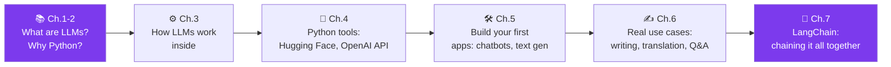
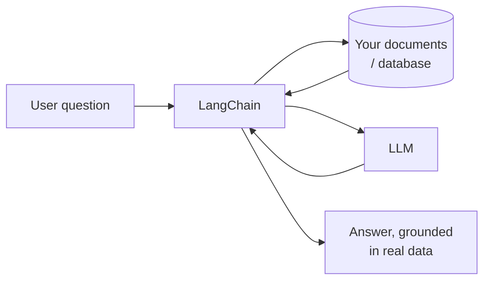

# 🤖 Introduction to Python and Large Language Models
### *by Dilyan Grigorov — A Guide to Language Models*

> ⏱️ **Reading time: ~14 minutes** | 🎯 **Level: Beginner-friendly, simple English** | 📚 **Covers all 7 chapters**

---

## The big idea, in one line

Large Language Models (LLMs) are AI systems trained to understand and generate human language — and **Python is the bridge** that lets ordinary developers, students and curious minds actually build things with them.

---

## 📑 Table of Contents

1. [Evolution & Significance of LLMs](#ch1)
2. [What Are Large Language Models?](#ch2)
3. [Python for LLMs — Under the Hood](#ch3)
4. [Python and Other Programming Approaches](#ch4)
5. [Basic Components of LLM Architectures — In Practice](#ch5)
6. [Applications of LLMs in Python](#ch6)
7. [LangChain and Building Real Applications](#ch7)
8. [Cheat-Sheet & Glossary](#cheat-sheet)

---

## 📘 Chapter 1 — Evolution and Significance of Large Language Models

### 🔑 Highlights (under 100 words)
This foundational chapter (over 50 pages in the original) explains how Natural Language Processing (NLP) evolved into today's LLMs. It covers **text preprocessing** (cleaning and preparing raw text), **word embeddings** (turning words into numbers a computer can compare and reason with), and **sentiment analysis** (detecting emotion/opinion in text). The chapter's goal is to give you a solid grip on *why* LLMs matter and how the field got here before touching any code.

### 📖 In Detail

Before computers could "understand" language at all, researchers had to solve a basic problem: computers only understand numbers, but language is made of words. **Word embeddings** are the clever trick that solves this — every word gets converted into a list of numbers (a "vector") in such a way that words with similar meanings end up numerically close to each other. This is why a well-trained model can complete "Paris is to France as Tokyo is to ___" correctly — it's really just doing number arithmetic on meaning.

**Text preprocessing** is the unglamorous but essential groundwork: removing punctuation, correcting typos, breaking sentences into words ("tokenizing"), and sometimes reducing words to their root form (e.g., "running" → "run"). **Sentiment analysis** is one of the first practical wins of this technology — automatically figuring out if a product review, tweet, or customer email is positive, negative, or neutral.

**🌍 Real-world scenario:** A customer support team receives 50,000 emails a month and can't read them all. By running sentiment analysis (built on the word-embedding techniques from this chapter), they automatically flag the angriest 200 emails each day for a human to handle first — turning an impossible task into a manageable, prioritised queue.

---

## 📗 Chapter 2 — What Are Large Language Models?

### 🔑 Highlights (under 100 words)
This chapter shifts from theory to tools, answering "why Python?" specifically. Python is popular for AI because of its simple, readable syntax and its enormous ecosystem of ready-made libraries. The chapter walks through Python fundamentals and the newer features in **Python 3.11**, giving readers exactly enough language knowledge to follow the rest of the book without needing to be professional programmers first.

### 📖 In Detail

Why did the entire AI field converge on one programming language? A few reasons the book highlights: Python code reads almost like English, which lowers the barrier for researchers who aren't professional software engineers; and decades of open-source contribution mean there's already a well-tested library for almost anything you'd want to do with data or models, so nobody has to reinvent the wheel.

Think of Python here like a universal power adaptor: the LLM itself (the "brain") could theoretically be accessed in several ways, but Python is the adaptor that plugs cleanly into every major AI toolkit — Hugging Face, OpenAI's API, PyTorch, TensorFlow — with minimal extra wiring.

**🌍 Real-world scenario:** A biology researcher with almost no coding background wants to use an LLM to summarise 200 scientific papers. Because Python's syntax is close to plain English (`for paper in papers: summarize(paper)`), she's able to follow a tutorial and get a working summariser running in an afternoon — something that would have taken a specialist software engineer working in a lower-level language much longer to build from scratch.

---

## 📙 Chapter 3 — Python for LLMs (How They Actually Work)

### 🔑 Highlights (under 100 words)
This is the technical heart of the book: **embedding layers**, **attention mechanisms**, and how models like GPT-4 and BERT actually predict the next word. You'll learn how LLMs "learn from a few examples" (few-shot learning) and — importantly — why they sometimes confidently produce wrong information (**hallucination**). Understanding this machinery demystifies what's really happening when you type a prompt.

### 📖 In Detail

At its core, an LLM's job is deceptively simple: given the words so far, **predict the single most likely next word**, then repeat that process thousands of times to build a full response. What makes modern LLMs so much better than older systems is the **attention mechanism** — a way for the model to weigh which earlier words in a sentence matter most when predicting the next one. In "The trophy didn't fit in the suitcase because it was too big," attention lets the model correctly figure out that "it" refers to the trophy, not the suitcase — by paying more "attention" to the relevant earlier word.

**Hallucination** happens because the model isn't actually looking up facts in a database — it's predicting statistically likely word sequences based on patterns learned during training. If a pattern *looks* confident and fluent, the model will produce it, even if it's factually wrong. This is the single most important limitation to understand before trusting any LLM output blindly.

**🌍 Real-world scenario:** A student asks an LLM to cite three academic papers on a niche topic. The model fluently generates three paper titles, authors, and even page numbers — all of which sound completely plausible and are entirely made up. This is a classic hallucination: the model is excellent at generating *text that looks like* a citation, but it has no built-in fact-checker verifying the citation is real. The lesson: always verify LLM-generated facts independently, especially names, dates, and numbers.

---

## 📕 Chapter 4 — Python and Other Programming Approaches

### 🔑 Highlights (under 100 words)
A practical, hands-on chapter covering the essential Python libraries, frameworks and platforms for working with LLMs — especially **Hugging Face** (a huge library of pre-trained, ready-to-use models) and the **OpenAI API** (pay-per-use access to models like GPT). It covers data preparation and gives basic working examples with each framework, showing how Python is democratising access to AI that used to require huge research labs.

### 📖 In Detail

Two main paths exist for using an LLM in your own project, and this chapter compares both:

| Approach | What it means | Best for |
|---|---|---|
| **Hugging Face** | Download an open, pre-trained model and run it yourself | Full control, privacy, customisation, free (needs your own computing power) |
| **OpenAI API** | Send a request over the internet to a hosted model | Fastest to start, no need to manage infrastructure, pay per use |

Data preparation matters more than most beginners expect: an LLM is only as useful as the quality of the examples or documents you feed it. Cleaning, formatting, and structuring your data properly before use is often what separates a working prototype from a frustrating one.

**🌍 Real-world scenario:** A small e-commerce startup wants a chatbot that answers questions about its own product catalogue. Using the OpenAI API, a single developer builds a working prototype in a weekend by feeding the model their product descriptions and a handful of example question-answer pairs — something that, only a few years earlier, would have required a dedicated data science team and months of work.

---

## 📔 Chapter 5 — Basic Overview of LLM Architecture Components (In Practice)

### 🔑 Highlights (under 100 words)
This chapter turns theory into working code: building text generators and simple chatbots step by step. Each example is designed to be followed along, so by the end you've actually built something — not just read about how it could be built. It's meant to inspire readers to imagine and start their own applications.

### 📖 In Detail

The chapter's philosophy is "build to understand." Rather than explaining attention mechanisms in the abstract again, it walks through concrete, runnable mini-projects: a script that generates text continuations from a prompt, and a simple rule-plus-LLM chatbot that can hold a basic conversation. Each step-by-step example reinforces a specific architectural concept from earlier chapters by making you see it in action.

**🌍 Real-world scenario:** A hobbyist wants to build a text-adventure game with an AI "dungeon master" that improvises the story. Following this chapter's step-by-step text-generation example as a starting template, they get a bare-bones version working in a single evening, then spend the following weekend adding rules and personality — a satisfying, low-stakes way to genuinely learn how the pieces fit together.

---

## 📓 Chapter 6 — Applications of LLMs in Python

### 🔑 Highlights (under 100 words)
A tour of what LLMs are actually used for today: **content creation, chatbots, virtual assistants, and data augmentation**; creative writing help (brainstorming, dialogue, world-building, even experimental literature); **language translation**; **text summarisation**; and **document understanding**. The chapter closes by building a working **question-answering chatbot**, tying every earlier concept together into one finished mini-project.

### 📖 In Detail

This chapter is essentially a "menu" of what's possible, grouped into a few big categories:

- **Creating content:** blog drafts, marketing copy, social captions
- **Conversational tools:** customer-support chatbots, virtual assistants
- **Creative writing:** brainstorming plot ideas, writing dialogue, building fictional worlds
- **Making sense of documents:** translation, summarising long reports, extracting key facts

**🌍 Real-world scenario:** A small news outlet uses an LLM-based summarisation tool (built using the techniques from this chapter) to turn dense 3,000-word government reports into clear 200-word briefs for their readers each morning — cutting a task that used to take a journalist 45 minutes down to a 5-minute review-and-edit pass.

The chapter's capstone project — a working Q&A chatbot — shows how translation, summarisation, and conversation all rest on the *exact same* underlying architecture from Chapter 3: predict the most likely next word, given everything said so far.

---

## 📒 Chapter 7 — LangChain and Building Real Applications

### 🔑 Highlights (under 100 words)
The final chapter introduces **LangChain**, a popular Python framework for chaining together model calls, external data, and memory into more sophisticated applications. It explains LangChain's core features — model interaction, data connection, and memory — and shows how companies use it in customer support, coding assistants, healthcare, and e-commerce, highlighting how flexible it is for building real, production-grade AI tools rather than one-off demos.

### 📖 In Detail

A single call to an LLM is like asking one very smart, very fast intern a single question. **LangChain** is what lets you build an actual assistant out of many such calls, wired together with:

- **Model interaction** — swapping between different LLMs easily
- **Data connection** — letting the model search your own documents, databases, or the web for facts (instead of relying purely on what it memorised during training — directly addressing the hallucination problem from Chapter 3)
- **Memory** — letting a chatbot remember earlier parts of the same conversation

**🌍 Real-world scenario:** A hospital wants an internal assistant that answers staff questions about its own clinical guidelines — not generic medical trivia. Using LangChain's "data connection" feature, the assistant first searches the hospital's actual, current policy documents for the relevant passage, then asks the LLM to summarise *that specific passage* in plain language. This grounding step is exactly what prevents the hallucination problem from Chapter 3 — the model is now summarising real text instead of guessing from memory.

---

## 🧭 Cheat-Sheet & Glossary

| Term | Plain-English meaning |
|---|---|
| **LLM** | An AI trained on huge amounts of text to predict and generate language |
| **Token** | A chunk of text (often a word or part of a word) the model processes at a time |
| **Embedding** | Turning words into numbers so a computer can compare their meaning |
| **Attention** | The model's way of deciding which earlier words matter most right now |
| **Hallucination** | Confident-sounding text that is factually wrong |
| **Fine-tuning** | Further training a general model on your own specific data |
| **LangChain** | A Python toolkit for chaining LLM calls together with data and memory |

### ✅ Key Takeaways
- LLMs predict the next word — they don't "know" facts the way a database does.
- Python wins because of readability + a massive ecosystem of ready-made tools.
- Hugging Face = run models yourself; OpenAI API = rent access to hosted models.
- Always verify facts an LLM generates — hallucination is a feature of *how* it works, not a rare bug.
- LangChain (or similar tools) is what turns a single clever response into a genuinely useful application.

---

*This summary is based on the complete chapter-by-chapter overview provided in the book's introduction, by Dilyan Grigorov (Apress).*