# The Resolution for Men — Your 30-Minute Guide

*Based on* The Resolution for Men *by Stephen Kendrick & Alex Kendrick (with Randy Alcorn), the companion book to the film* Courageous

> **A note on what this book actually is:** Despite a generic-sounding title, this is an explicitly **Christian, faith-based** men's discipleship book. It is not a secular self-help or productivity book — every chapter is built around Scripture, and the book's core structure is a set of 15 personal **vows ("I WILL...")** that a man prays through and signs, organized as a covenant before God. This guide treats it honestly on those terms so you know exactly what you're getting: a book for men who want a faith-rooted framework for manhood, marriage, and fatherhood — not a generic advice manual.

---

## How This Guide Works

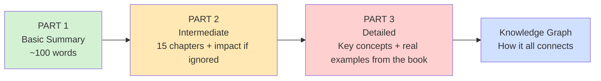

---

## PART 1: Basic Summary (The 100-Word Version)

The Resolution for Men argues that fatherlessness and passive manhood are at the root of society's deepest wounds, and that God calls men to actively resolve — not just intend — to be different. Part One (Ch. 1–3) diagnoses the problem: absent fathers, generational cycles, and "chains" of nature, choices, and nurture. Part Two (Ch. 4–15) is a series of 15 "I WILL" resolutions covering manhood, marriage, fatherhood, integrity, justice, and faith. The book's engine is accountability: read it, discuss it, sign it, live it — one deliberate choice at a time.

---

## PART 2: Intermediate — The 15 Resolutions, Chapter by Chapter

### The Two-Part Shape of the Book

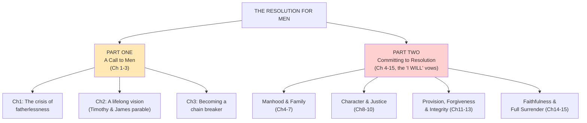

### Part One: Diagnosing the Problem (Ch. 1–3)

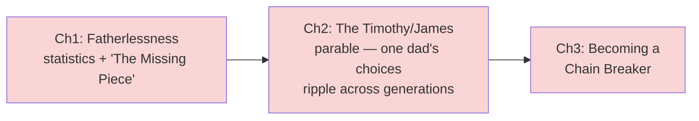

**What it covers:** Chapter 1 lays out the scale of fatherlessness and its social cost. Chapter 2 tells an extended parable of two men, "Timothy" and "James," whose very different responses to their own flawed fathers produce opposite legacies for their children and grandchildren. Chapter 3 names three kinds of "chains" a man inherits — chains of **nature** (his own sinful tendencies), chains of **his father's choices**, and chains of **nurture** (what he was taught/modeled) — and offers forgiveness, truth, breaking bad traditions, prayer, and consecration as the way to break them.

**Impact if ignored:** The book's argument is that men who never diagnose *why* they parent the way they do simply repeat their father's pattern — good or bad — by default. Skipping this part means skipping the self-awareness the entire rest of the book depends on; a man moves straight to "trying harder" without ever breaking the chain that is producing the behavior he wants to change.

### Group 1 — Manhood & Family (Ch. 4–7)

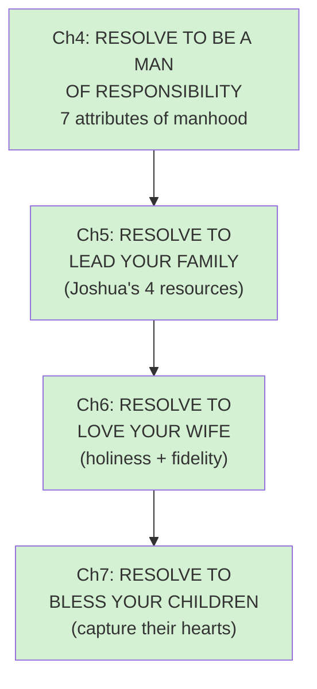

**What it covers:** Chapter 4 defines manhood with seven attributes (detailed in Part 3). Chapter 5 uses Joshua's leadership after Moses' death as the model for leading a household — with courage, not domination. Chapter 6 frames marriage as holy and calls men to guard against adultery and pornography. Chapter 7 gives fathers a three-part formula — Attention, Affirmation, Affection — to "capture" rather than lose their children's hearts.

**Impact if ignored:** The book warns that a man who never resolves his own responsibility drifts into passivity — the single behavior it blames for most family breakdown ("nobody wins, everybody loses"). A father who never intentionally blesses his children risks them chasing that affirmation elsewhere for the rest of their lives.

### Group 2 — Character & Justice (Ch. 8–10)

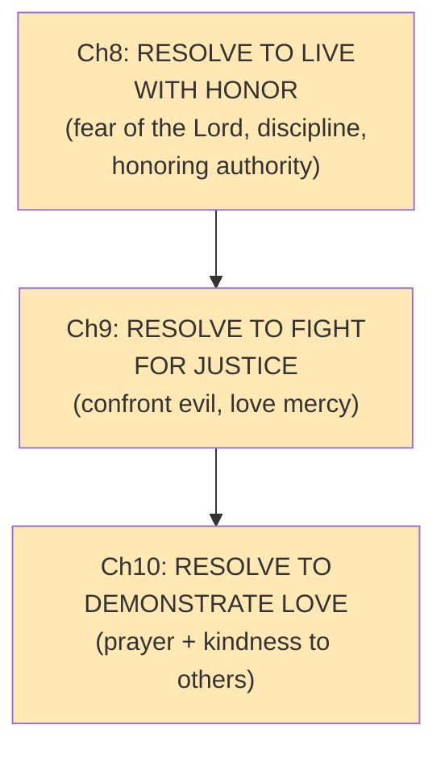

**What it covers:** Chapter 8 connects the "fear of the Lord" to honoring authority and disciplining children consistently — it argues discipline (including, controversially, spanking as one option) is an act of long-range love, not anger. Chapter 9 calls men out of passive media-consumption and into confronting real-world injustice, citing historical exemplars like Wilberforce, Bonhoeffer, and MLK. Chapter 10 focuses on demonstrating love through consistent prayer (the "Ten Locks / Ten Keys" framework) and everyday kindness.

**Impact if ignored:** A man with no honor/discipline framework, the book argues, raises children who don't respect authority and, eventually, don't respect him. A man who never engages issues of justice becomes numb to real suffering around him. A man who doesn't pray consistently, in this book's framing, is trying to lead a family on his own strength alone.

### Group 3 — Provision, Forgiveness & Integrity (Ch. 11–13)

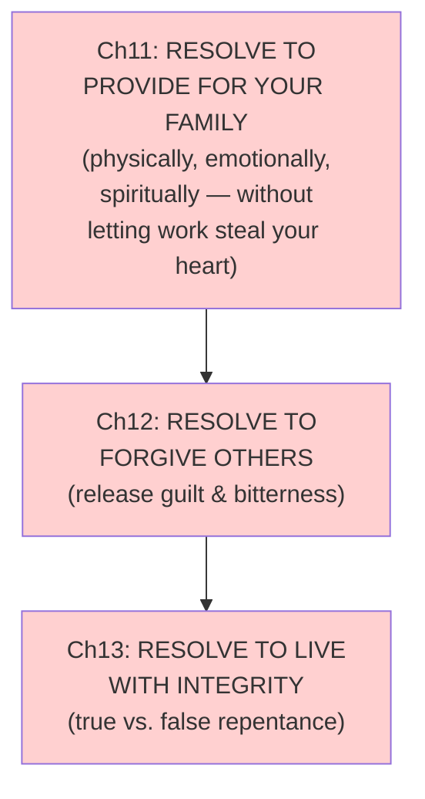

**What it covers:** Chapter 11 widens "provider" beyond a paycheck to emotional and spiritual provision, warning that work can quietly steal a man's heart from his family. Chapter 12 makes forgiveness (of self and others) a prerequisite for freedom, using Ephesians 4 on bitterness. Chapter 13 is one of the book's richest chapters: it contrasts King Saul's false repentance with King David's true repentance, and Judas's regret with Peter's genuine repentance, to define what integrity actually requires (detailed in Part 3).

**Impact if ignored:** Unforgiveness, the book argues, doesn't just harm relationships — it "holds a man back" from becoming who he's resolving to be. And a man who never learns the difference between regret and true repentance keeps repeating the same failures, because he's only ever sorry about consequences, never actually changed.

### Group 4 — Faithfulness & Full Surrender (Ch. 14–15)

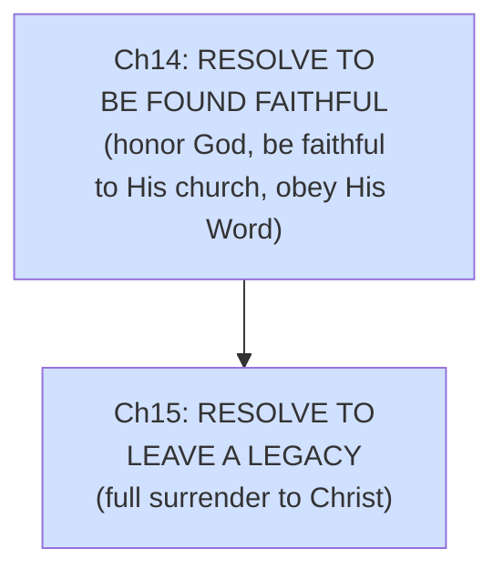

**What it covers:** Chapter 14 argues that seeking personal glory undercuts a man's integrity, and lays out four keys to being a healthy, connected part of a church community. Chapter 15 closes the book by calling for total, unreserved surrender to Christ as the only foundation strong enough to sustain everything promised in the other 14 chapters — framed through Luke 14's cost-of-discipleship teaching.

**Impact if ignored:** Without this final surrender, the book argues, the other 14 resolutions become another self-improvement project a man eventually abandons (like Peter's broken promises before his restoration) rather than a covenant sustained by God's power.

---

## PART 3: Detailed — Key Concepts With Examples From the Book

### 1. The Timothy & James Parable (Chapter 2)

The book's emotional core is an extended parable, not a real case study: two men, Timothy and James, both grow up with difficult, imperfect fathers. Timothy resents his father's failures and unconsciously repeats them, drifting and passive with his own kids. James, faced with the same kind of wounded father, makes a deliberate choice: he decides his story will be different, invests deeply and intentionally in his own children, and that choice visibly changes the trajectory of his grandchildren decades later. The parable exists to make one point concrete: **your response to your father's failures — not the failures themselves — determines what you pass on.**

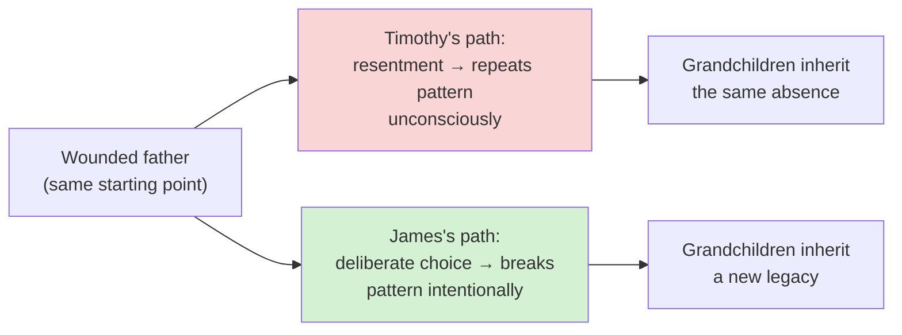

### 2. Three Chains, Three Remedies (Chapter 3)

The book identifies three distinct sources of a man's negative patterns, each needing a different fix:

| Chain Type | What It Is | The Book's Remedy |
|---|---|---|
| **Nature** | Your own sinful tendencies and weaknesses | Confession, repentance, relying on God's power |
| **Choices** | Specific sinful decisions your father (or you) made | Forgiveness — of him, and of yourself |
| **Nurture** | Harmful patterns/traditions modeled and taught to you | Consciously identifying them and replacing them with truth |

**Example the book gives:** a man whose father cheated (a *choice*-chain) must forgive that specific act, while a man raised in a home where anger was normalized (a *nurture*-chain) must recognize that pattern as taught behavior, not identity, and deliberately unlearn it.

### 3. The Seven Attributes of Manhood (Chapter 4)

The book's definition of manhood is built as seven cumulative attributes, each tied to a Scripture reference:

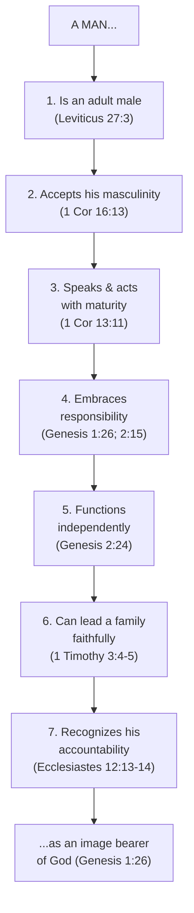

**Concrete illustration from the book:** attribute 4 (Responsibility) is illustrated with the example of a man who "supports an abortion to escape fatherhood" as the clearest case of irresponsibility avoiding its consequences — the book's language is blunt precisely to make responsibility feel non-negotiable rather than aspirational.

### 4. Joshua's Four Resources for Leadership (Chapter 5)

To answer "how does a man lead his family without dominating it," the book points to God's charge to Joshua after Moses' death (Joshua 1) as a model, identifying four resources God gave him:

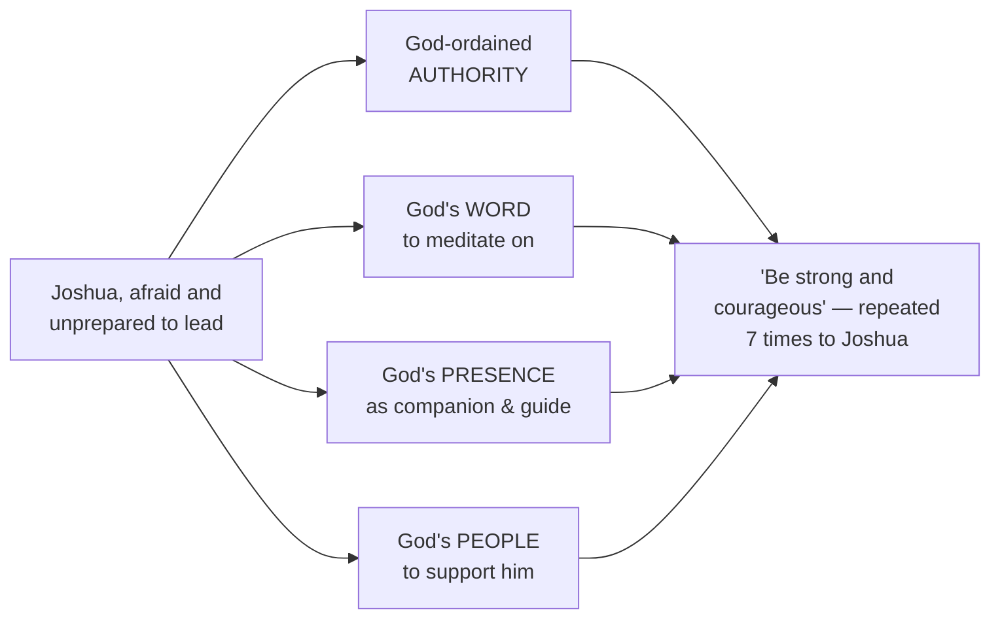

The book explicitly contrasts this servant-leadership model with domination: "the strong take advantage of the weak... but in God's biblical design of leadership, the strong die for the weak." It also directly rejects "50/50 leadership" as, in its words, "a farce that creates two heads and two people trying to drive at the same time" — while equally condemning historical patriarchal abuse of women as "incredibly wrong on multiple levels and never God's will."

### 5. Discipline as Long-Range Love (Chapter 8)

The book lays out a specific, practical sequence for how a father should discipline a child, which it frames as an act of love rather than anger:

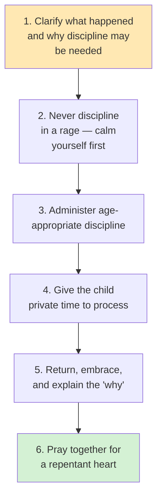

The book explicitly bounds physical discipline (never the face or head, never a closed fist, and only enough to "sting," never to injure) and stresses that discipline "should differ depending on the crime" — more mercy for ignorance, firmer consequences for willful, repeated defiance.

### 6. True vs. False Repentance (Chapter 13)

This is the book's most developed concept: it draws a sharp line between *regret* (sorry about consequences) and *true repentance* (a genuine change of heart and direction), using two paired biblical contrasts:

| | False repentance (regret) | True repentance |
|---|---|---|
| **Kings** | Saul — confessed only what was already exposed, blamed others, ended in shame | David — confessed completely, took full responsibility, ended in restored honor |
| **Disciples** | Judas — "had a change of mind," regretted, and despaired | Peter — "had a change of heart," repented, and lived the rest of his life in obedience |

The book's practical test for telling the two apart: **"Regret and tears don't mean repentance; change does."** If a man is only sorry about being caught, angry about consequences, and would do the same thing again given the chance, his repentance isn't real by the book's definition — no matter how emotional the apology sounds.

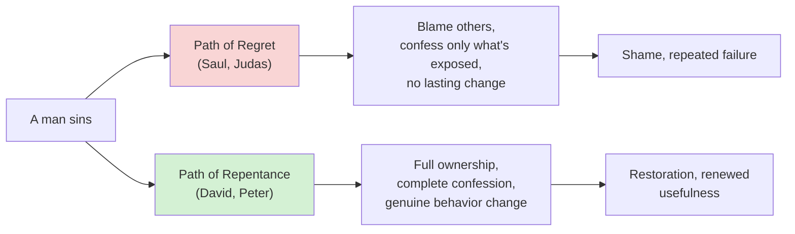

### 7. The Four Keys to Being Faithful to a Church (Chapter 14)

The book gives a practical, four-step formula for how a man should engage a faith community rather than remaining a spectator or dropping out after being hurt by "hypocrites":

1. **Show up and get involved** — attend consistently, join a small group, don't sit at the back and leave early.
2. **Fix your eyes on Jesus, not on people** — expect people (even leaders) to disappoint you; extend the same mercy you want.
3. **Be a blessing, not dead weight** — contribute your gifts rather than only consuming.
4. **Share life with other believers** — invite people in rather than staying isolated.

---

## Knowledge Graph — How the 15 Resolutions Connect

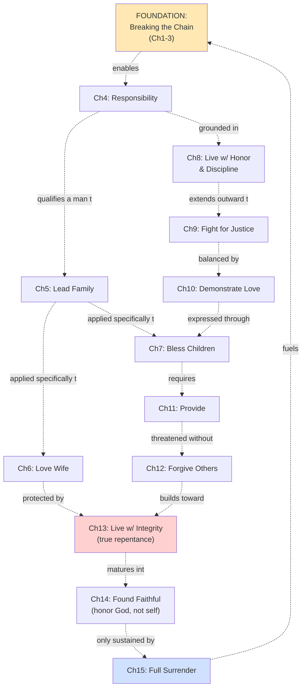

### Simplified Core Thread

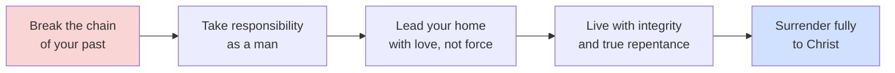

---

## Quick Reference: The 15 "I WILL" Resolutions at a Glance

| # | Chapter | Core Resolution |
|---|---|---|
| — | Ch1-3 | (Foundation) Break the chain of fatherlessness and past patterns |
| 4 | Resolve to Be a Man of Responsibility | Accept masculinity, act with maturity, own your responsibilities |
| 5 | Resolve to Lead Your Family | Love, protect, serve, and teach as spiritual leader |
| 6 | Resolve to Love Your Wife | Live in holiness and faithfulness |
| 7 | Resolve to Bless Your Children | Capture their hearts through attention, affirmation, affection |
| 8 | Resolve to Live with Honor | Train children to honor authority and live responsibly |
| 9 | Resolve to Fight for Justice | Confront evil, pursue justice, love mercy |
| 10 | Resolve to Demonstrate Love | Pray for others; treat all with kindness and respect |
| 11 | Resolve to Provide | Provide physically, emotionally, spiritually |
| 12 | Resolve to Forgive | Release bitterness and forgive those who've wronged you |
| 13 | Resolve to Live with Integrity | Learn from mistakes, repent fully, walk blamelessly |
| 14 | Resolve to Be Found Faithful | Honor God, be faithful to His church, obey His Word |
| 15 | Resolve to Leave a Legacy | Surrender completely to the lordship of Christ |

---

*This guide is a study companion synthesizing the structure and content of* The Resolution for Men *by Stephen & Alex Kendrick. For the full scriptural argument, personal stories, discussion questions, and appendices (including practical guidance on marriage, pornography, and starting a men's group), refer to the complete book.*
