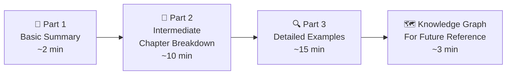
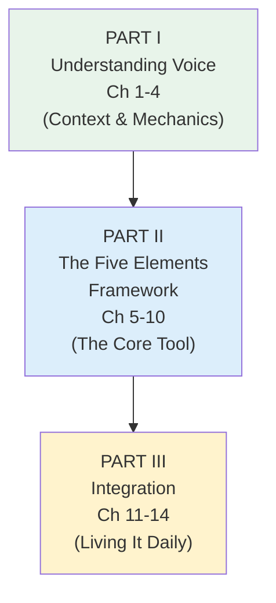
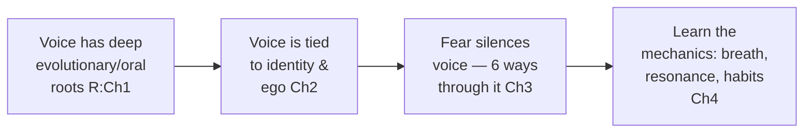
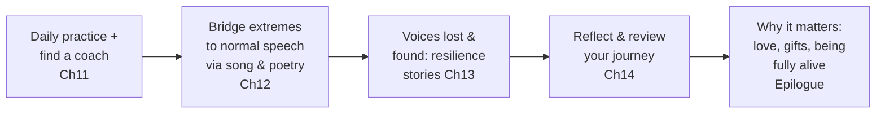
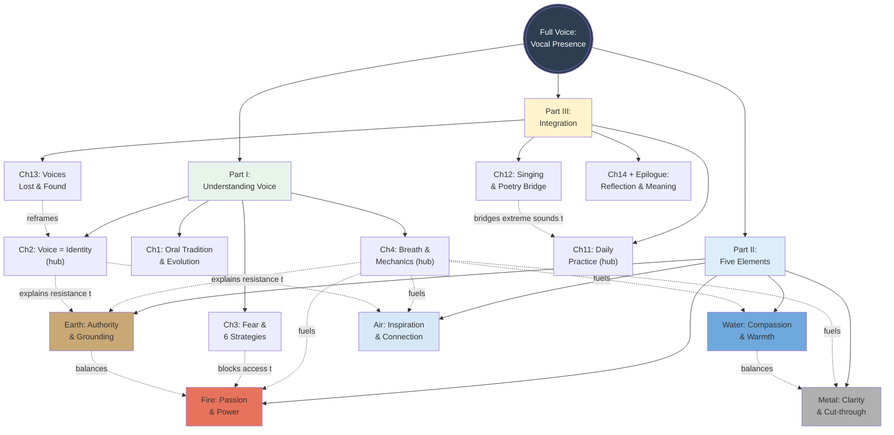
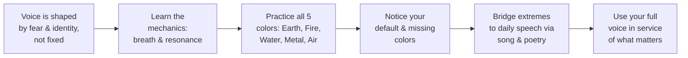

# Full Voice — Your 30-Minute Guide
### Based on *Full Voice: The Art and Practice of Vocal Presence* by Barbara McAfee

---

## How This Guide Works



---

# PART 1: BASIC SUMMARY (100 words)

*Full Voice* argues that your speaking voice isn't fixed — it's a living instrument shaped (and often narrowed) by fear, identity, culture, and habit, and it can be deliberately reopened. Voice coach Barbara McAfee organizes the book in three parts: first, **understanding voice** — its evolutionary roots, its link to who you think you are, the fear that silences it, and the basic mechanics of breath and sound; then her core tool, the **Five Elements Framework** — Earth, Fire, Water, Metal, and Air voices, each carrying different communicative gifts; and finally **integration** — using singing and poetry to carry these vocal colors into everyday speech, work, and relationships.

---

# PART 2: INTERMEDIATE — The Three Parts Explained

The book has **3 Parts** spanning **14 chapters** (plus an epilogue). Think of it as a journey from understanding why your voice sounds the way it does, to deliberately expanding its palette, to weaving that fuller voice into daily life.



---

## Part I — Understanding Voice (Chapters 1–4)

**What it's about:** Before changing your voice, you need context. Chapter 1 traces voice back through human evolution and the oral tradition — proof that voice is ancient, sacred technology, not just a delivery mechanism for words. Chapter 2 links voice to identity — the ego polices your voice the way it polices everything else about "who you are." Chapter 3 tackles fear (stage fright, "glossophobia") head-on with six practical coping strategies. Chapter 4 is "Voice 101" — the physical mechanics of breath, resonance, and common bad habits, plus vocal-health basics.



**Impact if this Part's lessons are ignored:**
If you skip the identity work, you'll keep attacking symptoms (a monotone, a mumble) instead of the root cause — the outdated self-story that decided long ago which sounds were "safe" to make. Ignoring the fear chapter means stage fright continues running the show: you'll keep shrinking your delivery to avoid perceived risk, and audiences will sense the mismatch between your words and your body. And skipping Voice 101 means you'll keep straining your throat with poor breath support, risking chronic hoarseness, vocal fatigue, or nodes — problems that are often mechanical, not talent-related, and are fixable with awareness alone.

---

## Part II — The Five Elements Framework (Chapters 5–10)

**What it's about:** The heart of the book. McAfee identifies five distinct vocal "colors," each sourced in a different part of the body and each suited to different communicative purposes — much like a chakra system mapped onto sound.

```mermaid
flowchart TD
    EARTH["🌍 EARTH\nGut, legs, pelvis\nAuthority, grounding,\ngut instinct"]
    FIRE["🔥 FIRE\nSolar plexus\nPassion, personal\npower, vitality"]
    WATER["💧 WATER\nChest/throat\nCaring, compassion,\naffirmation"]
    METAL["⚙️ METAL\nSinuses/\"the mask\"\nClarity, focus,\ncuts through noise"]
    AIR["💨 AIR\nAbove the head\nInspiration, possibility,\nspiritual connection"]

    EARTH --- FIRE --- WATER --- METAL --- AIR
    style EARTH fill:#c9a876
    style FIRE fill:#e8735c
    style WATER fill:#6fa8dc
    style METAL fill:#b0b0b0
    style AIR fill:#d6e8f7
```

**Impact if this Part's lessons are ignored:**
Without deliberately practicing the full range, most people get stuck using only one or two default "colors" — for example, only Earth and Metal (like Bill and Hillary Clinton in the book's example) — which causes vocal fatigue in the overused colors and leaves whole categories of communication (comfort, inspiration, warmth) permanently unavailable. A leader stuck in Earth/Fire will struggle to express genuine compassion (Water) during a layoff conversation; a technically brilliant but monotone speaker stuck without Fire will fail to move an audience no matter how good the content is. The book's repeated finding: an imbalance in vocal range directly limits the situations you can navigate well.

---

## Part III — Integration (Chapters 11–14 + Epilogue)

**What it's about:** Theory and isolated exercises aren't enough — Chapter 11 gives a daily practice guide and advice for finding a voice coach; Chapter 12 makes the case for singing and poetry as the bridge between extreme vocal exercises and natural, everyday speech; Chapter 13 tells moving stories of people who lost their literal voice (through illness, surgery, trauma) and found other ways to "speak"; Chapter 14 closes with reflective review questions, and the Epilogue reframes the entire book around mortality and what really matters.



**Impact if this Part's lessons are ignored:**
Skipping integration is the most common failure mode in any skills-based self-improvement work: you do the dramatic exercises once, feel a breakthrough, and then slide back into old habits because you never built a bridge back to ordinary conversation. McAfee is explicit that singing and poetry are that bridge — without them, the extreme character voices (the Neanderthal, the fire-and-brimstone preacher) stay quarantined as "exercises" and never actually change how you present in a meeting or a difficult conversation. And without the reflective habit in Chapter 14, you lose the compounding awareness that turns a one-time workshop into a "lifelong adventure," as the book calls it.

---

# PART 3: DETAILED — Concepts Explained with Examples

## Part I in Depth: Understanding Voice

**Chapter 1 — Voice, Instinct, and the Oral Tradition:** McAfee roots voice in deep history: your hearing was fully formed by three months in utero, your first act at birth was vocal (crying), and spoken language itself is only ~100,000 years old, always preceded by vocalization. *Example:* Australian Aboriginal "songlines" — 40,000-year-old sung maps that let travelers navigate the outback by memory, encoding both geography and spiritual meaning in voice alone. The takeaway: voice was never "just for information" — for most of human history it carried culture, safety, and survival.

**Chapter 2 — Voice and Identity:** Your ego acts like "a psychological immune system," McAfee writes — it defines what's "you" and attacks anything that isn't, including new sounds. *Example:* a health-care executive client told McAfee that working with her voice meant being invited to be "everything I'm not supposed to be: primitive, fat, shrill, dramatic, silly, lusty, and loud" — and finding relief and delight in it. Another example: "Nelson," who scrubbed his Boston accent to fit in at college and now can't get it back even when he wants to — illustrating how thoroughly we edit our voices to match a chosen identity, often at a real cost.

**Chapter 3 — Brain Rats (Fear):** McAfee's own seven-year journey through paralyzing stage fright (she never sang solo until an accidental gig in 1982) anchors this chapter. Her Six Suggestions for Moving Through Fear: (1) commit to a spiritual discipline like meditation; (2) "slow down to body time" — because racing thoughts, shallow breath, and adrenaline feed each other in a downward spiral; (3) put your fear "on an attention diet" rather than fighting it; (4) practice compassion toward the fearful part of you (reframe fear as an overzealous guardian, not an enemy); (5) "surf the big waves of adrenaline" instead of suppressing them; (6) focus on something that matters more than the fear itself. *Example:* her client Gina, a recruiting-firm leader, stopped obsessing over how the audience judged her and shifted focus to what she wanted to give them — "I'm getting over myself," as Gina put it — and her stage fright transformed.

**Chapter 4 — Voice 101:** The physical mechanics: sound starts with breath crossing the vocal cords in the larynx, then resonates through the throat, sinuses, and hard palate. *Example exercise:* the four-step rib/diaphragm exercise (hold a breath and feel the ribcage; exhale with a hiss while keeping ribs open; add an "ah" tone; then practice standing with ribs open during ordinary activities like brushing teeth) — which McAfee says improves posture and presence as a side effect, not just vocal power. The chapter also lists common bad habits (monotone, dropping sentence-ends, upspeak, filler words) and a vocal-health checklist: hydrate, limit caffeine, sleep 7+ hours, exercise, release jaw/neck tension, and treat allergies and acid reflux, which are common hidden causes of chronic hoarseness.

---

## Part II in Depth: The Five Elements Framework

**The Earth Voice (gut instinct, authority, grounding):** Sourced in the gut/pelvis/legs, this is the deepest and darkest of the five voices — "I peed on it, it's mine" energy, McAfee jokes, tracing it back to primal territorial instinct. *Example:* a midwife interviewed for the book relies almost entirely on the earth voice during the most intense stage of labor, because in crisis, people revert to primal instinct and rational words stop landing — tone matters more than content. *Too much:* sounds like a "dolt or bully" and is vocally "expensive" (causes hoarseness). *Too little:* client "Marie" talked so fast her presentations lost her audience and her promotion — slowing down and accessing earth tones (via floor exercises and poetry) fixed both her delivery and her chronic insomnia.

**The Fire Voice (passion, personal power, vitality):** Centered in the solar plexus, this is the voice of great orators (Martin Luther King Jr.'s "I Have a Dream") and athletes (the Maori haka war dance — "ha" means breath, "ka" means fire). *Example:* "Ted," an introverted architecture-firm president, discovered he had a big, resonant fire voice hiding beneath a lifetime of Midwestern reserve; after practicing with singing and physical exercises (pushing against McAfee back-to-back while vocalizing), he delivered a passionate, podium-free conference talk that generated new business. *Too much:* "Dan, the Wall of Sound," a former construction-crew leader whose default volume-ten voice intimidated his office staff and customers — he learned to find his "inside voice" using softer Air and Water practice songs. *Too little:* "Pam," running for mayor, had a girlish voice that undercut her decades of real qualifications; practicing along with Aretha Franklin and Bonnie Raitt recordings helped her access a lower, more forceful register — and she won the election.

**The Water Voice (caring, compassion, affirmation):** Sourced in the chest/throat, this is the voice of comfort, apology, praise, and warm welcome. *Example:* a gruff wood-products-company CEO wanted to build a more appreciative culture; his words changed, but his voice didn't match until he learned to bring genuine water-voice warmth into his tone — after which morale visibly improved. A cautionary counter-example: a Lutheran minister was shocked to learn his sermon voice turned "stormy" and "intimidating" even though his personality off the pulpit was warm and jolly — an unconscious habit adopted early in his career to seem "serious and credible" that was actually sabotaging his intent.

**The Metal Voice (clarity, focus):** Sourced in "the mask" (nose, eyes, forehead), McAfee calls this "the cheapest sound in the mall" because it cuts through noise using minimal breath. *Example:* Broadway legend Ethel Merman built her entire career on this sound, projecting to the back of un-amplified 1930s theaters. Client "Robert," a salesman who kept losing cocktail-party conversations because his low, husky Earth voice couldn't compete with ambient noise, learned to add a touch of Metal and immediately became easier — and more magnetic — to talk to. *Too much:* an example of a woman in a restaurant whose piercing, nasal Minnesota-accented voice was audible across a noisy room — impressive projection, but exhausting to listen to for long.

**The Air Voice (inspiration, possibility, spiritual connection):** Floats "a few inches above your head," McAfee writes, blending minimal tone with a great deal of breath — think hushed excitement, whispered intimacy, or a parent babbling at a baby. *Example:* "Violet," a brilliant but perpetually "twelve-years-old-sounding" analyst, built her Air-heavy voice's missing counterparts (Fire, Earth, Metal) through martial-arts-style shouts and floor work; the payoff arrived unexpectedly at a family reunion when her hard-of-hearing grandmother told her, for the first time ever, "I've never been able to hear you very well until today" — a moment Violet valued even above her career breakthrough. *Too little:* McAfee's own long resistance to the Air voice (as a tall, strong, low-voiced woman) only broke open while playing "Boodle the Poodle" with her three-year-old stepson — proof that access to a missing element can come from unexpected, playful places.

**The Clintons — a real-world diagnostic example:** McAfee uses Bill and Hillary Clinton to show opposite imbalances in real, famous voices: Hillary Clinton's courtroom-honed Metal edge read as "grating" on sensitive TV microphones, while Bill Clinton's breathy Earth/Air blend was pleasant but vocally "expensive," contributing to his chronic hoarseness through two terms of heavy public speaking.

---

## Part III in Depth: Integration

**Chapter 11 — Practice Guide:** McAfee's clients get creative about finding places to practice loudly and without self-consciousness — the car, the shower, racquetball courts, stairwells. She recommends interviewing a prospective voice coach about their methodology and experience before committing, and suggests a simple daily habit: notice which of the five elements you're using in any given conversation, and what that might reveal about your intentions.

**Chapter 12 — The Case for Singing and Poetry:** Fewer than 2% of people are truly "tone deaf" in a clinical sense — most self-described "worst singers" are simply out of practice. *Example:* a psychotherapist client keeps a mental list of comforting songs to offer clients mid-session — "there were things the song could do that my words just couldn't," he said. Another: a new grandmother composed a custom lullaby for her grandson, recorded so he can hear it even when she's not there. On poetry: McAfee recites Shakespeare's "Tomorrow, and tomorrow, and tomorrow" soliloquy from Macbeth (which she first heard her mother recite while doing dishes) as an example of how memorized, well-spoken language can transform ordinary moments — and offers a step-by-step method for "bringing a poem to life" through physical imagination, pacing, and eventual memorization.

**Chapter 13 — Voices Lost and Found:** Powerful counter-stories about people who communicate without a conventional speaking voice. *Example:* Karly Wahlin, a composer living with Rett syndrome who cannot speak, communicates and creates award-caliber piano music one laborious keystroke at a time — her album is titled *In My Own Voice*. *Example:* King George VI's stammer (dramatized in *The King's Speech*) required years of unconventional coaching before he could deliver wartime radio broadcasts that reassured a nation. *Example:* Maya Angelou stopped speaking entirely between ages 8 and 12 after trauma, later becoming one of the most celebrated voices in American letters. The lesson: voice can be lost to illness, trauma, or surgery, and can still return — or find a different form entirely — as a source of strength.

**Chapter 14 & Epilogue:** The book closes with reflective review questions across every theme (identity, fear, breath, the five elements, song, poetry) and a personal epilogue about McAfee's father's death, which led her to found The Morning Star Singers — volunteers who sing at hospice bedsides. Her closing framing: at the end of life, people don't ask about status or achievement — they ask "Whom did I love? Who loved me in return? Did I give my gifts while I was here?" Vocal presence, in the end, is framed as a vehicle for giving those gifts while you can.

---

# KNOWLEDGE GRAPH — For Future Reference



### The Core Thread (Read This If You Remember Nothing Else)



## Quick Reference Table — The Five Elements at a Glance

| Element | Body Source | Core Gift | Too Much | Too Little |
|---|---|---|---|---|
| Earth | Gut, legs, pelvis | Authority, grounding, gut instinct | Sounds like a bully; vocally "expensive" (fatigue) | Sounds ungrounded, rushed, uncertain |
| Fire | Solar plexus | Passion, personal power, vitality | Intimidating, overwhelming | Passionless, invisible, hard to take seriously |
| Water | Chest/throat | Caring, compassion, affirmation | Can't project to large groups; causes hoarseness | Cold, robotic, emotionally absent |
| Metal | Sinuses/"the mask" | Clarity, focus, cuts through noise | Grating, shrill, exhausting to hear | Muffled, mumbled, gets talked over |
| Air | Above the head | Inspiration, possibility, intimacy | Dizzying; sounds unserious or "twelve years old" | Heavy, joyless, no sense of wonder |

## Quick Reference Table — All 3 Parts at a Glance

| Part | Chapters | Theme | One-Line Takeaway |
|---|---|---|---|
| I. Understanding Voice | 1–4 | Context & Mechanics | Your voice is ancient, tied to identity, and mechanically learnable |
| II. Five Elements Framework | 5–10 | The Core Tool | Deliberately practice all five vocal colors, not just your defaults |
| III. Integration | 11–14 + Epilogue | Living It Daily | Song and poetry bridge exercises into everyday, meaningful speech |

---

*Guide prepared as a condensed companion to Barbara McAfee's* Full Voice: The Art and Practice of Vocal Presence.
