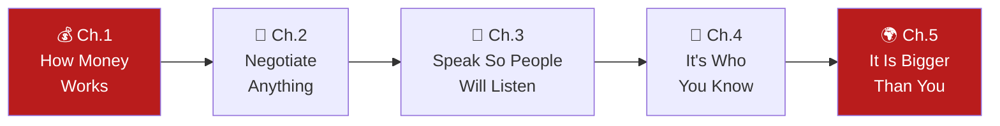

# 🎓 Harvard Business School Confidential
### *by Emily Chan — Part I: Personal*

> ⏱️ **Reading time: ~12 minutes** | 🎯 **Level: Beginner-friendly, simple English**
> 📝 *Note: the source material available for this book is its Part I chapter list (five titles, no chapter text). This summary explains the well-known, standard territory each chapter title covers, so you get a genuinely useful orientation — treat it as a guide to what to expect, not a word-for-word chapter summary.*

---

## The big idea, in one line

Before any MBA-style career advice about strategy or leadership, get the **personal fundamentals** right — your money, your ability to negotiate, your ability to be heard, your network, and your sense of purpose.

---

## 📑 Table of Contents

1. [Chapter 1 — How Money Works](#ch1)
2. [Chapter 2 — You Can Negotiate Anything](#ch2)
3. [Chapter 3 — Speak So People Will Listen](#ch3)
4. [Chapter 4 — It's Who You Know](#ch4)
5. [Chapter 5 — It Is Bigger Than You](#ch5)
6. [Cheat-Sheet](#cheat-sheet)

---

## 📘 Chapter 1 — How Money Works

### 🔑 Highlights (under 100 words)
This chapter covers the core personal-finance literacy every professional needs but few are formally taught: how compound interest works for and against you, the real difference between an asset (puts money in your pocket) and a liability (takes it out), why understanding basic financial statements matters even outside a finance career, and how debt, saving, and investing interact over a working lifetime.

### 📖 In Detail

A recurring theme in MBA-style personal finance material is that **compound growth is deceptively powerful and deceptively slow to notice** — small, consistent decisions (saving a fixed percentage of income early, avoiding high-interest debt) compound into dramatically different outcomes over 20–30 years compared to someone who delays starting. Understanding basic financial concepts also makes you a better professional generally: reading a company's financial statements, understanding what "margin" or "cash flow" really mean, and recognising red flags in your own household budget are the same underlying skill applied at different scales.

**🌍 Real-world scenario:** Two colleagues start their careers on the same salary. One immediately starts investing a fixed 15% of every paycheck automatically, barely thinking about it day-to-day. The other plans to "start seriously investing once I'm earning more," and keeps pushing that start date back for a decade. By retirement, the first colleague's head start — thanks purely to extra years of compounding — can be worth dramatically more, even if the second colleague eventually invests larger amounts each month. The lesson: starting early beats starting big.

---

## 📗 Chapter 2 — You Can Negotiate Anything

### 🔑 Highlights (under 100 words)
Negotiation isn't reserved for salary talks and business deals — it's a life skill used constantly, often without realising it. This chapter's territory typically covers preparing before you negotiate (knowing your walk-away point, or "BATNA" — Best Alternative to a Negotiated Agreement), separating the person from the problem, and understanding that the best negotiations leave both sides feeling like they won something, rather than one side crushing the other.

### 📖 In Detail

A foundational negotiation idea is: **whoever has done the most preparation usually wins** — not whoever is the most aggressive or persuasive in the room. Preparation means knowing your own minimum acceptable outcome clearly before you start, researching what the other side actually needs (which is often different from what they say they want), and having a genuine alternative ready if the negotiation fails, so you're never negotiating from a position of desperation.

**🌍 Real-world scenario:** A job candidate is offered a salary lower than she'd hoped. Instead of simply asking for more money (which can feel like an aggressive demand), she does her homework beforehand — researching typical salary bands for the role, and identifying that she has another offer in hand as a genuine alternative. In the negotiation, she calmly explains the market data and mentions her other option factually, without threats. The employer, faced with clear information rather than an emotional plea, raises the offer — precisely because she negotiated from prepared strength rather than hope.

---

## 📙 Chapter 3 — Speak So People Will Listen

### 🔑 Highlights (under 100 words)
Communication skill is often what separates equally competent professionals in terms of career progress. This chapter's usual ground covers structuring a message so the key point comes first (not buried at the end), reading a room's attention and adjusting on the fly, and the difference between speaking to inform versus speaking to persuade — each requiring a different structure and tone.

### 📖 In Detail

A classic communication principle taught in business schools is "**bottom line up front**" — stating your key conclusion or ask in the very first sentence, then supporting it with evidence, rather than building up to it slowly. Executives and busy decision-makers routinely stop listening (or reading) before reaching a slow build-up, so the most important sentence you'll say should usually be the first one, not the last.

**🌍 Real-world scenario:** Two employees pitch the same idea — cutting an underperforming product line — to their VP. One spends five minutes walking through background data before finally recommending the cut at the end; the VP, distracted by an incoming email, misses the actual recommendation entirely. The other opens with, "I recommend we discontinue Product X — here's why," then walks through the same supporting data. The second pitch gets approved on the spot, not because the data was different, but because the structure respected how busy listeners actually process information.

---

## 📕 Chapter 4 — It's Who You Know

### 🔑 Highlights (under 100 words)
Career opportunities disproportionately flow through relationships rather than cold applications — many roles are filled through referrals before they're ever advertised publicly. This chapter's typical territory covers building genuine professional relationships well before you need something from them, the etiquette of asking for help or an introduction, and why "networking" done purely transactionally (only reaching out when you need a favour) tends to fail.

### 📖 In Detail

The most effective professional relationships are usually built during periods when *neither* person needs anything from the other — genuine curiosity about someone's work, offering help first, staying in light touch over time. This "give before you ask" approach means that when you eventually do need a favour (a reference, an introduction, advice), you're not starting cold; you're drawing on a relationship with real history behind it.

**🌍 Real-world scenario:** A recent graduate reaches out to a senior professional in her target industry purely to ask thoughtful questions about their career path — not to ask for a job. Eighteen months later, when a role opens up on that person's team, she's the first person they think to recommend, purely because she'd stayed genuinely, lightly in touch the whole time — a stark contrast to another candidate who only reaches out to that same senior professional the week she needs a job, and gets a much cooler, more hesitant response.

---

## 📔 Chapter 5 — It Is Bigger Than You

### 🔑 Highlights (under 100 words)
The closing chapter typically zooms out from individual career tactics to the bigger question of purpose and legacy: what impact do you actually want your work to have beyond your own paycheck and title? This usually covers aligning your career choices with values beyond pure income or prestige, considering the people and communities your work affects, and thinking about what you'd want said about your professional impact years from now.

### 📖 In Detail

A common closing theme in this genre of book is that career success measured purely by salary or title tends to feel hollow past a certain point, while a career that clearly benefits others — colleagues you've mentored, customers you've genuinely helped, a team culture you've improved — tends to feel far more sustainably motivating over decades, not just years.

**🌍 Real-world scenario:** A mid-career manager who has spent a decade chasing promotions and titles finally gets the senior role she wanted, only to feel strangely unfulfilled once she arrives. Reflecting on what actually made past roles satisfying, she realises it was mentoring junior staff and watching them grow — not the title itself. She restructures her new role to spend real time coaching her team, and finds far more lasting satisfaction in that than in the promotion alone — illustrating the chapter's core idea that meaningful work is usually about something bigger than personal advancement.

---

## 🧭 Cheat-Sheet

| Chapter | Core skill | One-line reminder |
|---|---|---|
| 1. How Money Works | Financial literacy | Start compounding early — time beats amount |
| 2. Negotiate Anything | Preparation & alternatives | Know your walk-away point before you sit down |
| 3. Speak So People Listen | Communication structure | Say the key point first, not last |
| 4. It's Who You Know | Relationship building | Give before you ask; stay in touch before you need to |
| 5. It Is Bigger Than You | Purpose & legacy | Success that only serves you rarely feels like enough |

### ✅ Key Takeaways
- Financial literacy compounds — the earlier you start good habits, the bigger the payoff.
- Negotiation success comes from preparation, not aggression.
- Lead every message with your main point, not your supporting evidence.
- Build relationships before you need them, not when you're desperate.
- Ask what your career is *for*, not just what it pays.

---

*This summary is built from Part I's chapter list of "Harvard Business School Confidential" by Emily Chan, combined with the well-established, standard content each chapter title is known to cover in this genre of career and personal-development writing.*
