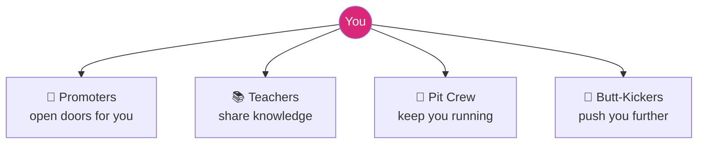

# 🤝 It's Who You Know
### *How to Make Networking Work for You — by Janine Garner*
### *Foreword by Lisa Messenger, Founder & Editor-in-Chief, Collective Hub*

> ⏱️ **Reading time: ~13 minutes** | 🎯 **Level: Beginner-friendly, simple English**

---

## The big idea, in one line

You don't need a *bigger* network — you need a **smaller, smarter one**: a tight "Nexus" of around 12 key people who genuinely help you grow, chosen deliberately instead of accumulated by accident.

---

## 📑 Table of Contents

1. [Foreword — The Power of a Small Introduction](#fw)
2. [Chapter Theme 1 — Network vs. Nexus](#t1)
3. [Chapter Theme 2 — Why Your Current Network May Be Failing You](#t2)
4. [Chapter Theme 3 — The Four Roles of a Strong Nexus](#t3)
5. [Chapter Theme 4 — Building & Nurturing Your Nexus](#t4)
6. [Chapter Theme 5 — Taking Control: Your Action Plan](#t5)
7. [Cheat-Sheet](#cheat-sheet)

---

## 🌟 Foreword — The Power of a Small Introduction

### 🔑 Highlights (under 100 words)
Lisa Messenger opens the book with a personal story: she once made a handful of simple introductions for a struggling entrepreneur — nothing more than connecting him to a few of her own contacts over coffee. Years later, she watched from the sidelines as his profile grew from a single newspaper feature to national media appearances, then international ones, then a published book. Her point: connection is a force multiplier, and the smallest, most generous introduction can compound into someone else's life-changing success — and yours too.

### 📖 In Detail

The foreword's central lesson isn't about grand networking strategy — it's about the outsized power of small, generous acts. Messenger didn't do the entrepreneur's PR work for him; she simply introduced him to the right two or three people, at the right time, with the right context. Everything that followed was his own hard work, but none of it would have started without that first connection.

**🌍 Real-world scenario:** Messenger's own business, Collective Hub, grew into a magazine sold in almost 40 countries — but she's candid that key turning points came from other people's introductions: someone connected her to the right book agent, someone else to an international distributor, another to Richard Branson. The lesson isn't "network harder" — it's "be generous with introductions, and be open to receiving them," because you never know which small connection becomes the pivotal one.

---

## 📘 Theme 1 — Network vs. Nexus

### 🔑 Highlights (under 100 words)
Everyone's been told "networking is essential" — but most people either dread it or reduce it to collecting social-media followers and business cards. The book's central reframe: **your network matters less than the right 12 people in it** — your "Nexus." Quality beats quantity, always. As leadership expert John C. Maxwell puts it, "those closest to you determine your level of success."

### 📖 In Detail

Garner draws a sharp distinction between *networking* (the activity — attending events, adding LinkedIn connections, collecting business cards) and having a *Nexus* (a small, deliberately-chosen circle of people who genuinely influence your thinking and outcomes). Having thousands of social media connections doesn't automatically mean you have real support — it can even create a false sense of security, since "friend" and "follower" counts don't correlate with who will actually pick up the phone when it matters.

**🌍 Real-world scenario:** Garner describes her own career — ten years building a corporate career in the UK, then moving to Australia at 29, rebuilding her network from scratch each time she moved. Despite being highly "connected" in a professional sense at each stage, she describes feeling genuinely isolated without a *true* network to lean on — showing that professional connectivity and real support are two very different things.

---

## 📗 Theme 2 — Why Your Current Network May Be Failing You

### 🔑 Highlights (under 100 words)
The book challenges readers to audit their existing network honestly: what's working, what isn't, who's adding value, and — bluntly — who's draining your energy. Without a deliberate network, opportunities get missed, your thinking stagnates, and life transitions (a job change, a move to a new city) can leave you starting from zero, over and over.

### 📖 In Detail

A theme running through the book is that most people's networks form by *accident* — old classmates, coworkers from a job they've since left, people they met once at a conference — rather than by deliberate design. This accidental network often quietly includes "energy drainers": people who take more than they give, or whose presence subtly discourages ambition rather than encouraging it.

**🌍 Real-world scenario:** Imagine two professionals both changing careers. One has a wide but shallow LinkedIn network of ex-colleagues who barely remember them. The other has spent years nurturing five or six genuine relationships across different industries. When it's time to make a bold career move, the second person makes one phone call and has three warm introductions within a week — while the first person is stuck cold-emailing strangers, illustrating exactly why the book insists depth beats breadth.

---

## 📙 Theme 3 — The Four Roles of a Strong Nexus

### 🔑 Highlights (under 100 words)
Garner describes building her own personal network around four distinct roles: **Promoters** (people who open doors and talk you up when you're not in the room), **Teachers** (people who share knowledge and expertise generously), **Pit Crew** (people who keep you functioning day-to-day — practical, reliable support), and **Butt-Kickers** (people who push you further than you'd push yourself, refusing to let you settle for less).

### 📖 In Detail

The genius of this framework is that it forces you to check for *gaps*. Many people's networks are accidentally lopsided — plenty of Teachers (people happy to give advice) but no Butt-Kickers (people willing to hold them accountable), or plenty of Pit Crew but nobody actively Promoting them to new opportunities. A well-balanced Nexus deliberately includes all four roles, because each does a job the others can't.

**🌍 Real-world scenario:** A freelance graphic designer has several mentors happy to give feedback on her portfolio (Teachers) and a supportive partner who handles the admin side of her business (Pit Crew) — but nobody ever refers her to new clients (no Promoters), and nobody challenges her to raise her rates or pursue bigger projects (no Butt-Kickers). Once she deliberately seeks out one strong Promoter and one honest Butt-Kicker, her business growth accelerates in a way years of just "networking more broadly" never achieved.

---

## 📕 Theme 4 — Building & Nurturing Your Nexus

### 🔑 Highlights (under 100 words)
Building a Nexus isn't passive — the book stresses being **intentional rather than organic**, and **always reciprocating**. A Nexus isn't a one-way pipeline of favours; it thrives on genuine, two-way generosity, maintained actively over time rather than assembled once and forgotten. The book includes checklists and worksheets (and an online diagnostic tool) to help readers map their current network against the ideal Nexus structure.

### 📖 In Detail

Garner's own "LBDGroup" — a community of results-oriented businesswomen she founded in 2011 — is presented as a living case study: as the group grew, individual members formed their own smaller, strategically-chosen networks *within* the larger community, each one intentionally built around what that person specifically needed to grow. The lesson: even within a large community, the real value comes from the smaller, deliberate Nexus each person curates for themselves.

**🌍 Real-world scenario:** A member of a large professional association attends events regularly but never becomes closer to anyone. Following this section's advice, she picks just three people from that large group whose skills and generosity impress her, and instead of "networking" broadly at the next event, she deliberately follows up with only those three afterward — offering to help with something of theirs first. Over the following year, all three become genuine, reciprocal parts of her personal Nexus — proof that intentional depth beats another year of surface-level mingling.

---

## 📔 Theme 5 — Taking Control: Your Action Plan

### 🔑 Highlights (under 100 words)
The book closes with a direct challenge: you can either take control of who you surround yourself with, or let your network drift and shift depending on circumstances. Franklin D. Roosevelt's line is quoted approvingly: *"I'm not the smartest fellow in the world, but I can sure pick smart colleagues."* The goal isn't perfection — it's a small, deliberate, ongoing practice of curating who gets your time and trust.

### 📖 In Detail

This closing section reframes networking from an occasional, anxiety-inducing event (a conference, an awkward mixer) into an ongoing, low-key discipline — regularly reviewing your Nexus, checking it against the four roles, and being willing to actively invite new people in (or let faded connections go) as your goals evolve.

**🌍 Real-world scenario:** Every January, a small business owner blocks out one hour to literally write down her current Nexus of 12 people against the four roles from Theme 3. One year, she realises she has three Teachers but zero Promoters as she moves into a new market — so her one deliberate goal for the next quarter is simply to build one new Promoter relationship, rather than "networking more" in a vague, unfocused way.

---

## 🧭 Cheat-Sheet

| Concept | In one line |
|---|---|
| **Network** | Everyone you're loosely connected to |
| **Nexus** | The ~12 people who actually, deliberately move your success forward |
| **Promoters** | People who talk you up and open doors when you're not in the room |
| **Teachers** | People who generously share knowledge and expertise |
| **Pit Crew** | People who keep your day-to-day running smoothly |
| **Butt-Kickers** | People who push you further and won't let you settle |
| **Intentional, not organic** | Choose your Nexus deliberately — don't let it just happen to you |

### ✅ Key Takeaways
- Quality of relationships beats sheer number of connections, every time.
- Audit your network honestly: who adds value, who drains your energy?
- A balanced Nexus needs all four roles — Promoters, Teachers, Pit Crew, Butt-Kickers.
- Reciprocity is non-negotiable: give as generously as you hope to receive.
- Review and rebuild your Nexus regularly as your goals change.

---

*This summary is based on the foreword by Lisa Messenger and the full introduction to "It's Who You Know" by Janine Garner.*