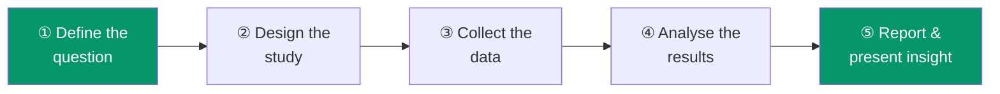

# 🔍 Market Research in Practice
### *4th Edition — by Paul Hague, with Nick Hague, Carol-Ann Morgan, Julia Cupman, Matthew Harrison & Oliver Truman*

> ⏱️ **Reading time: ~13 minutes** | 🎯 **Level: Beginner-friendly, simple English**
> 📝 *Note: this summary is built from the book's preface (which explains its scope, history, and what's new in this edition) plus the well-established, standard structure of market research practice that the book teaches.*

---

## The big idea, in one line

Good market research is a repeatable **process**, not a single clever survey — and understanding the whole journey from question to insight makes you a far better practitioner, even if you'll only ever specialise in one part of it.

---

## 📑 Table of Contents

1. [The Author's Story — Why This Book Exists](#story)
2. [The Market Research Process, Start to Finish](#process)
3. [Qualitative vs. Quantitative Research](#qual-quant)
4. [Designing a Questionnaire People Will Actually Answer Honestly](#questionnaire)
5. [Sampling — Who Do You Actually Ask?](#sampling)
6. [The Digital Shift — Zoom, Online Research & GDPR](#digital)
7. [Reporting — Turning Data into Decisions](#reporting)
8. [Cheat-Sheet](#cheat-sheet)

---

## 📘 The Author's Story — Why This Book Exists

### 🔑 Highlights (under 100 words)
Paul Hague has been writing about market research since 1985, and this fourth edition — now written mostly solo, in semi-retirement — reflects thirty-six years of industry change. He's blunt that what he learned early in his career has "little relevance today": the industry has moved from a cottage industry of enthusiasts using calculators and acetates to a global, billion-dollar industry. This edition was finished right around the pandemic, adding fresh chapters on **social and political opinion polling** and **GDPR** (data protection law).

### 📖 In Detail

What makes this preface worth reading on its own is its honesty about how fast an entire profession can be reinvented. Hague openly admits that decades of hands-on experience don't automatically make him qualified to write about *today's* market research — because the tools, methods, and even the basic shape of the job have transformed multiple times over his career. Where a single researcher once designed the survey, ran the interviews, analysed the data by hand, and presented the results personally, today's industry is far more specialised: most researchers now focus on just one part of that chain.

**🌍 Real-world scenario:** Imagine a market researcher who started their career in the 1980s, physically laying out transparent "acetate" sheets with hand-drawn charts for a client presentation. By the time they retire, they're commissioning online surveys distributed by algorithm to thousands of respondents in an afternoon, with dashboards updating results in real time. The book's core message is that this pace of change isn't unusual for the field — it's the norm — so successful researchers build an underlying understanding of *why* each step of the process exists, rather than memorising today's specific tools, which will likely be replaced again within a decade.

---

## 📗 The Market Research Process, Start to Finish

### 🔑 Highlights (under 100 words)
Even though today's researchers usually specialise in one stage, understanding the *whole* pipeline makes every specialist better at their own part. The process generally runs: clarify the business question → design the study and sample → collect data (via interviews, surveys, or focus groups) → analyse the results → write and present a report that a non-researcher can actually use to make a decision.

### 📖 In Detail

A recurring warning in good research practice: **a report writer who doesn't understand how the data was collected produces a worse report**, even if their writing is excellent — because they can't judge what the numbers can and can't reliably tell you. Similarly, a survey designer who never has to write the final report often designs surveys that are technically clever but painful to translate into a clear recommendation. This is why the book insists every researcher, regardless of their specialism, benefits from understanding the whole chain, end to end.

**🌍 Real-world scenario:** A retail chain wants to know why a new store format is underperforming. A researcher who only knows "run a survey" might send out a generic satisfaction questionnaire and get bland, unhelpful results. A researcher who understands the *whole* process starts instead by clarifying the actual business question with the client ("Is it a location problem, a product-mix problem, or a service problem?"), which completely changes what questions get asked, who gets sampled, and how the final report gets structured — turning "customers rated us 6.2 out of 10" into "the underperformance is concentrated in stores with a specific product-mix issue, fixable within 90 days."

---

## 📙 Qualitative vs. Quantitative Research

### 🔑 Highlights (under 100 words)
Market research broadly splits into two complementary approaches: **qualitative** research (small-scale, in-depth — focus groups, one-on-one interviews — designed to explore *why* people think and feel the way they do) and **quantitative** research (larger-scale surveys designed to measure *how many* people think or feel a certain way, with statistical confidence). Neither replaces the other — they answer fundamentally different kinds of questions.

### 📖 In Detail

A simple way to remember the difference: qualitative research finds the *right questions*; quantitative research finds the *right numbers*. If you don't yet know why customers are unhappy, a small number of in-depth interviews or a focus group will surface the real underlying issues in their own words — issues you likely wouldn't have thought to ask about in a fixed survey. Once you understand the landscape of issues, a large-scale quantitative survey then tells you how widespread each issue actually is, so you can prioritise fixing the biggest one first.

**🌍 Real-world scenario:** A phone manufacturer suspects battery life is hurting sales, but a round of focus groups (qualitative) reveals customers are actually far more frustrated by the *charging cable design* — something the company hadn't even considered as an issue. A follow-up large-scale survey (quantitative) then confirms that 40% of dissatisfied customers cite the cable specifically, versus only 12% mentioning battery life — completely redirecting the product team's next design sprint.

---

## 📕 Designing a Questionnaire People Will Actually Answer Honestly

### 🔑 Highlights (under 100 words)
A poorly worded questionnaire produces confidently wrong data — arguably worse than no data at all, because it *looks* trustworthy. Good questionnaire design avoids leading questions, keeps wording simple and neutral, orders questions so early ones don't bias later answers, and always pilot-tests the questionnaire on a small group before rolling it out widely.

### 📖 In Detail

A subtle trap in questionnaire design is the **leading question** — one that nudges the respondent toward a particular answer without the researcher even realising it. "How much did you enjoy our excellent new product?" quietly assumes the product is excellent and pressures a positive answer, versus the neutral "What did you think of our new product?" Question *order* matters too: asking about price sensitivity right before asking about overall satisfaction can quietly bias the satisfaction answer downward, simply because price is now fresh in the respondent's mind.

**🌍 Real-world scenario:** A restaurant chain's first-draft survey asks, "How satisfied were you with our friendly and attentive staff?" — a leading question that inflates positive responses. After a pilot test flags the issue, it's rewritten to "How would you rate the service you received?" with a neutral 1–5 scale. The revised, neutral version reveals a genuine service problem at certain locations that the leading version had been quietly hiding.

---

## 📔 Sampling — Who Do You Actually Ask?

### 🔑 Highlights (under 100 words)
You can rarely survey *everyone* in your target market, so choosing a representative **sample** — a smaller group that accurately reflects the whole population you care about — is one of the most technically important steps in the whole process. A biased or badly chosen sample can make an otherwise well-designed survey completely misleading, no matter how well-worded the questions are.

### 📖 In Detail

A classic sampling mistake is convenience: surveying only the customers who happen to answer their phone during the day (who skew toward retirees or people not working standard hours), or only people active on one particular social media platform. Good sampling deliberately corrects for these biases, aiming for a group that mirrors the true make-up of the market being studied — by age, region, income, or whatever factors matter most for the specific question being asked.

**🌍 Real-world scenario:** A bank wants to understand young professionals' attitudes toward mobile banking, but its research team initially surveys existing branch customers who happen to walk in — a sample skewed heavily toward older, less digitally-engaged customers. Recognising the bias, the researchers switch to a deliberately quota-controlled online panel matching the real age distribution of their target young-professional segment — completely changing the survey's conclusions about mobile banking demand.

---

## 📓 The Digital Shift — Zoom, Online Research & GDPR

### 🔑 Highlights (under 100 words)
This edition captures a pivotal industry shift: the pandemic normalised **video-call interviews and online focus groups**, which the author notes can now match or exceed the cost, speed, and engagement of traditional in-person research. The book also adds a dedicated new chapter on **GDPR** (Europe's General Data Protection Regulation), reflecting how seriously the modern industry must now treat participants' personal data and privacy rights.

### 📖 In Detail

Before the pandemic, tools like Zoom and Teams were barely known in research circles; face-to-face interviews and in-person focus group viewing rooms were considered the gold standard. The forced shift to remote work proved that video-based research can work just as well — sometimes better, since participants can join from home without travel time, widening who can realistically take part. At the same time, collecting people's opinions and personal details online raises real legal and ethical obligations, which is exactly why GDPR compliance earned its own dedicated chapter in this edition — researchers must now be as fluent in data-protection law as they are in questionnaire design.

**🌍 Real-world scenario:** A researcher planning focus groups for a healthcare product pre-pandemic would have flown participants into a single physical viewing facility, an expensive and slow process that limited the diversity of who could realistically attend. Running the same focus groups over Zoom post-pandemic lets the team include participants from rural areas who'd never have made it to a city-centre research facility — while GDPR-compliant consent forms and data storage ensure each participant's personal health-related comments are legally and ethically protected throughout.

---

## 📒 Reporting — Turning Data into Decisions

### 🔑 Highlights (under 100 words)
The final, and arguably most important, skill is turning a pile of data into a report that a busy decision-maker will actually read, understand, and act on. Good market research reporting states the business question clearly, presents the data honestly (including its limitations), and ends with clear, actionable recommendations — not just a wall of charts.

### 📖 In Detail

A common failure mode in market research is producing a technically accurate report that nobody in the boardroom can actually use — 40 pages of charts with no clear "so what." The book's underlying philosophy (echoed throughout the preface) is that a researcher who understands the *entire* process, not just their own narrow specialism, writes reports that connect the data directly back to the original business question, making the recommended action obvious rather than something the reader has to reverse-engineer themselves.

**🌍 Real-world scenario:** Two researchers analyse the exact same survey data on why a product's sales are declining. One delivers a 50-slide deck full of cross-tabulated charts with no summary. The other opens with a single clear sentence — "Sales are declining because of a specific packaging issue among first-time buyers, and fixing it could recover an estimated 15% of lost sales" — before showing the supporting charts. Only the second report actually gets acted on by the busy executive team, even though both researchers analysed identical data.

---

## 🧭 Cheat-Sheet

| Concept | In one line |
|---|---|
| **Qualitative research** | Small-scale, in-depth — finds out *why* |
| **Quantitative research** | Large-scale, numeric — finds out *how many* |
| **Leading question** | A question that nudges the respondent toward a particular answer |
| **Sample** | A smaller group chosen to represent the whole target population |
| **GDPR** | EU data-protection law governing how you collect and store personal data in research |
| **Pilot testing** | Trying a questionnaire on a small group before rolling it out widely |

### ✅ Key Takeaways
- Understand the whole research process, even if you'll only ever specialise in one stage of it.
- Use qualitative research to find the right questions; quantitative research to find the right numbers.
- Watch for leading questions and biased samples — both quietly produce confidently wrong data.
- Video/online research can match in-person quality while widening who can take part.
- A great report connects data directly to a clear, actionable recommendation — not just charts.

---

*This summary is based on the preface of "Market Research in Practice" (4th Edition) by Paul Hague, and on the standard, well-established process the book is known to teach.*

