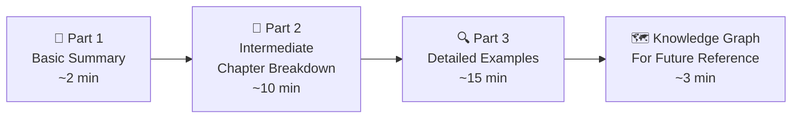
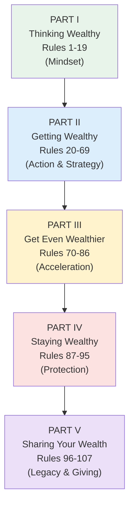
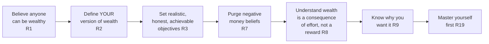
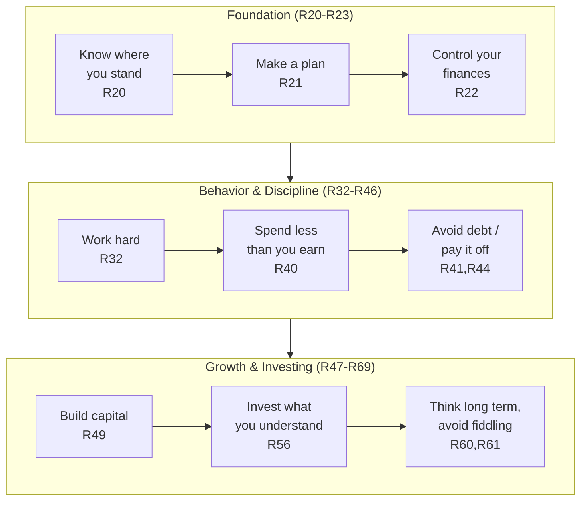
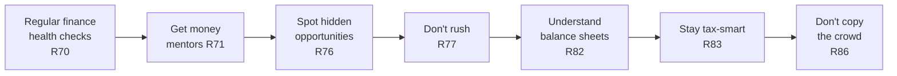
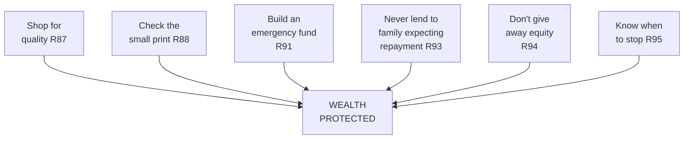
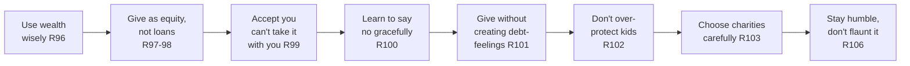
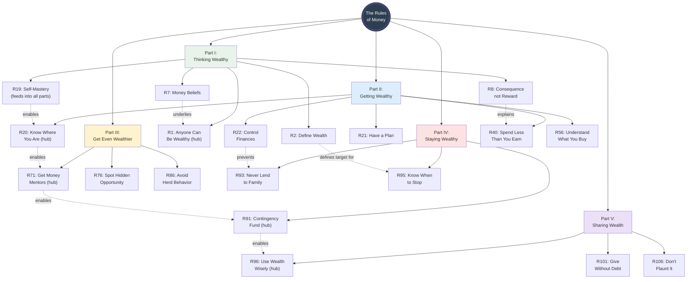
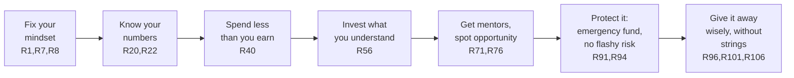

Rules of money 30min guide · MD
# The Rules of Money — Your 30-Minute Guide
### Based on *The Rules of Money* by Richard Templar (Expanded Edition)
 
---
 
## How This Guide Works
 
This guide distills a 196-page, 107-rule book into three layers, each going one level deeper. Read Part 1 in two minutes if that's all you have. Read all three parts for the full 30-minute experience.
 

 
---
 
# PART 1: BASIC SUMMARY (100 words)
 
*The Rules of Money* argues that wealth isn't luck, inheritance, or talent — it's a learnable skill built from 107 practical habits. Richard Templar organizes these into five stages: first, **think** like a wealthy person (drop poverty myths, define what "rich" means to you); then **get** wealthy (budget, save, invest, negotiate, avoid debt); then **get even wealthier** (find mentors, spot opportunities, read financial statements); then **stay** wealthy (protect what you've built from bad decisions, poor insurance, and overspending); and finally **share** wealth wisely (give without creating dependency, raise grounded children, avoid being flattered out of your money).
 
---
 
# PART 2: INTERMEDIATE — The Five Parts Explained
 
The book has **5 Parts** containing **107 Rules**. Think of them as five chapters in a journey from "broke mindset" to "wealthy and staying that way."
 

 
---
 
## Part I — Thinking Wealthy (Rules 1–19)
 
**What it's about:** Before you can build wealth, you have to demolish the mental blocks that keep most people poor — beliefs like "money is dirty," "I'm not the type to be rich," or "wanting money makes me a bad person." This section is about mindset, self-honesty, and deciding — precisely — what "wealthy" even means to *you*.
 

 
**Impact if this chapter's lessons are ignored:**
If you skip the mindset work, everything downstream collapses. You'll chase wealth without knowing what "enough" looks like, so you'll never feel satisfied even if you get rich (or you'll quit early because the goal was fuzzy). Old beliefs like "money corrupts" or "I don't deserve it" will unconsciously sabotage your effort — you'll self-destruct opportunities without realizing why. Without self-discipline (Rule 19), no strategy in Parts II–V will stick, because managing money is really about managing yourself first.
 
---
 
## Part II — Getting Wealthy (Rules 20–69)
 
**What it's about:** This is the largest, most practical section — the actual "how-to." It covers taking a full financial inventory, building a plan, cutting wasteful spending, understanding debt, learning to negotiate and sell, and investing sensibly (stocks, property, and your own skills).
 

 
**Impact if this chapter's lessons are ignored:**
Without a financial audit (Rule 20) and a plan (Rule 21), money manages you instead of the other way around — bills, debts, and impulse spending quietly erode any income increase. Ignoring the debt rules (41, 42, 44) means interest payments silently transfer your future earnings to banks and credit card companies. Skipping the investing rules (48–58) leaves your savings sitting idle, losing value to inflation, or — worse — gambled away on stock tips and get-rich-quick schemes (Rule 67) that predictably fail.
 
---
 
## Part III — Get Even Wealthier (Rules 70–86)
 
**What it's about:** Once the basics are working, this section is about acceleration — finding mentors, spotting hidden opportunities, learning to read a balance sheet, staying tax-efficient, and not blindly following the herd.
 

 
**Impact if this chapter's lessons are ignored:**
Without regular check-ups (Rule 70) small problems compound unseen. Without mentors (Rule 71) you learn everything the slow, expensive way — through your own mistakes instead of borrowed experience. Rushing (ignoring Rule 77) is how solid savers lose money in bad deals. And blindly following the herd (ignoring Rule 86) means you buy assets at their most expensive and sell at their cheapest — the classic way ordinary investors underperform the market.
 
---
 
## Part IV — Staying Wealthy (Rules 87–95)
 
**What it's about:** Making money is one skill; keeping it is another. This chapter is defensive — shopping for quality over cheapness, reading contract small print, maintaining an emergency fund, never lending to friends and family without expecting to lose it, and knowing when a business venture has run its course.
 

 
**Impact if this chapter's lessons are ignored:**
This is where "getting rich" and "staying rich" diverge — plenty of lottery winners and even celebrities have gone broke by skipping exactly these rules. No emergency fund (Rule 91) means one crisis forces you into high-interest debt or a forced asset sale. Lending to family expecting repayment (ignoring Rule 93) reliably destroys both money and relationships. Giving away equity carelessly (ignoring Rule 94) or not knowing when to exit a failing venture (ignoring Rule 95) can unwind years of hard-won progress in a single decision.
 
---
 
## Part V — Sharing Your Wealth (Rules 96–107)
 
**What it's about:** The final chapter is about wealth's endgame — using it wisely, giving generously without creating entitlement or resentment, protecting your children from being spoiled, choosing charities well, and staying humble and discreet rather than flaunting what you have.
 

 
**Impact if this chapter's lessons are ignored:**
Money mismanaged at this final stage undoes a lifetime of discipline. Lending instead of gifting to friends/family (ignoring Rules 97–98) breeds resentment on both sides. Over-protecting children from ever experiencing financial limits (ignoring Rule 102) tends to produce entitled, unmotivated heirs. And flaunting wealth (ignoring Rule 106) invites envy, exploitation by opportunists, and — as the book bluntly notes — plain old "gotcha clauses" from anyone looking to relieve you of it.
 
---
 
# PART 3: DETAILED — Concepts Explained with Examples
 
## Part I in Depth: Thinking Wealthy
 
**Rule 1 — Anybody Can Be Wealthy:** Templar's foundational claim: money "doesn't care what color or race you are, what class you are, what your parents did." He's watched wealthy people who have "nothing in common" except that each one said "yes please, I want some of that," while the poor say "not for me, I'm not worthy." *Example:* the book frames every subsequent rule as simply the "application" required — there's no secret gatekeeping, only effort.
 
**Rule 2 — Decide on Your Definition of Wealth:** A wealthy friend told Templar he wouldn't consider himself truly wealthy until he was living off "the interest on the interest" of his capital — not the capital itself, not even the interest on it. *Example:* this friend tracks, during a dinner out, whether the interest earned during the meal exceeds the meal's cost — if yes, he's happy. The lesson: without a personal, specific definition of "enough," you can never know if you've succeeded.
 
**Rule 5 — Most People Are Too Lazy to Be Wealthy:** Templar lists Bill Gates, Richard Branson, Warren Buffett, James Dyson, and Petr Kellner (the Czech Republic's first billionaire) as proof that wildly different wealthy people share exactly one trait: they "work their socks off." *Example:* people who buy a lottery ticket "as a sort of half-hearted gesture of wanting to be rich" without being willing to do the work.
 
**Rule 8 — Wealth Is a Consequence, Not a Reward:** Money isn't handed out by a "committee who examine whether you deserve it" — it's a direct result of value delivered. *Example:* a man who charges $2,000 to wash and polish rich people's cars. Is that a "reward"? No — it's simply the market price for being the best at a specific, valuable skill.
 
**Rule 15 — Money and Happiness:** "Money doesn't buy happiness" is true, but nuanced: money is "a placebo, not a cure." *Example:* the feeling you get sitting in a new BMW isn't in the car — it was already inside you; the car didn't manufacture happiness, it just triggered a feeling you already had access to. What money *can* do is remove a lot of unhappiness (worry, insecurity) — it just can't manufacture happiness from nothing.
 
**Rule 16 — Price vs. Value:** Templar asked his father-in-law why a $100 restaurant bottle of wine can be worth 20 times a $15 shop bottle. Answer: "you aren't paying for the wine alone" — you're paying for ambience, service, trust, and occasion. *Example:* his own battered old Mercedes, worth less in price than a friend's shiny new hatchback, but of far higher intrinsic value because it's better engineered and rarely breaks down — teaching that price and value are frequently unrelated.
 
---
 
## Part II in Depth: Getting Wealthy
 
**Rule 20 — Know Where You Are Before You Start:** Modeled on Robinson Crusoe checking his shipwrecked supplies before making any plan. *Example:* the book has you build a literal net-worth table (assets like house, savings, pension, investments minus debts like mortgage, credit cards, loans) — you cannot navigate financially with no starting coordinates.
 
**Rule 22 — Get Your Finances Under Control:** Templar's blunt advice: "cut up all the cards and pay them off" if you're using credit as a crutch. *Example:* he suggests tracking every single expense for even just one week to see exactly where "leakages" are happening — because most overspending is invisible until written down.
 
**Rule 24 — Only by Looking Wealthy Can You Become Wealthy:** Not about designer labels — about **effort and presentation**. *Example:* for his first casino-industry job interview, Templar (broke at the time) bought an inexpensive but sharp double-breasted jacket and hand-tied bow tie, practiced for hours, and stood out enough to be hired despite having zero relevant qualifications. Lesson: "restrained elegance," not flashiness — bling and logos read as amateur, not wealthy.
 
**Rule 35 — Small Economies Won't Make You Wealthy but They Will Make You Miserable:** (Referenced across other rules) — obsessing over cutting small pleasures (the "cappuccin­o index") doesn't move the needle on real wealth, it just makes daily life joyless. The bigger levers (income, investing, debt) matter far more than skipping coffee.
 
**Rule 40 — Spend Less Than You Earn:** The single simplest, most-ignored rule in personal finance — deceptively obvious, yet most financial ruin traces back to violating exactly this.
 
**Rule 43 — Cultivate a Skill and It'll Repay You Over and Over:** A skill, unlike a one-time sale, is a renewable asset — you can sell your expertise again and again (this is effectively how Templar frames his own book-writing: "even while I sleep there is a bookshop somewhere... selling books for me").
 
**Rule 56 — Only Buy Shares (or Anything) You Can Understand:** If you can't explain an investment simply, you shouldn't be in it — a direct guard against both scams and your own overconfidence.
 
**Rule 67 — Don't Answer Ads That Promise Get-Rich-Quick Schemes:** "It won't be you who gets rich quick" — the ad's author already got rich, from you.
 
---
 
## Part III in Depth: Get Even Wealthier
 
**Rule 71 — Get Some Money Mentors:** Rather than reinventing every wheel yourself, attach yourself (informally) to someone who has already done what you want to do. *Example:* Templar describes hanging "on every word" of his own money mentor — someone living off interest-on-interest — because watching a successful model up close compresses years of learning.
 
**Rule 82 — Know Why You Should Be Able to Read a Balance Sheet — and How:** Whether investing in shares, buying a business, or evaluating a partner's company, the ability to read basic financial statements separates informed decisions from guesses.
 
**Rule 86 — Don't Follow the Same Route as Everyone Else:** Herd behavior in investing is a proven wealth-destroyer — the crowd tends to pile in near market tops and flee near market bottoms.
 
---
 
## Part IV in Depth: Staying Wealthy
 
**Rule 90 — Put Something Aside for Your Old Age — No, More Than That!:** A pointed warning that most people's mental estimate of "enough for retirement" is too low; the rule's emphatic title ("more than that!") drives home how commonly this is underestimated.
 
**Rule 91 — Put Something Aside for Emergencies (the Contingency Fund):** Directly tied to Rule 23's insurance logic — instead of paying an insurer their margin every month, many wealthy people self-insure by keeping a liquid reserve for exactly the situations insurance would have covered, and pocket the difference.
 
**Rule 93 — Never Borrow Money from Friends or Family (but You Can Allow Them to Invest):** A crucial distinction — a loan creates a creditor-debtor relationship (obligation, resentment, awkwardness at every family dinner). Structuring the same money as an investment/equity stake changes the psychology entirely: both sides share the upside and downside as partners, not as lender and defaulter.
 
---
 
## Part V in Depth: Sharing Your Wealth
 
**Rule 100 — Know When/How to Say No — and Yes:** Once you have money, you become a magnet for requests — framed as loans, investment "opportunities," or emotional appeals. Templar's filter: say no if your gut says no, if the person hasn't done any homework on their own proposal, or if you have no real connection to them. Crucially: **be clear**. "No maybes, no 'I'll sleep on it'" — a clean no is kinder than a lingering ambiguous one.
 
**Rule 101 — Find Ways to Give People Money Without Them Feeling They Are in Your Debt:** The book treats this as a genuine skill, not an afterthought. *Example approaches offered:* the "you might win the lottery one day" framing (implying reciprocity might flow the other way by luck); the "fortunes change" framing (today I'm up, tomorrow I might need your help); or quietly taking equity in a family member's home upgrade rather than "lending" them money for it — so it's a shared investment, not a debt.
 
**Rule 102 — Don't Over-Protect Your Children from the Valuable Experience of Poverty:** A deliberately provocative title. Templar argues a monthly allowance that forces budgeting, and *never* telling children in advance about a future inheritance, keeps them motivated. *Example:* "nothing demotivates a child more than thinking they're coming into money" — they stop trying if the safety net is visible in advance.
 
**Rule 103 — Know How to Choose Charities/Good Causes:** Templar's personal method: reject any charity that directly solicits him (it filters for causes he sought out on his own terms), prefer small charities over massive ones because a given dollar goes further, and favor charities that "help directly" (e.g., "teaching villagers to fish") over those that simply distribute aid.
 
**Rule 104 — Spend Your Own Money Because No One Will Spend It as Wisely as You:** *Example:* Templar describes a wealthy friend who hands all spending decisions to staff — his gardener buys top-of-the-line mowers on the friend's dime, caterers over-charge for parties — and while the friend can technically "afford it," he's being quietly ripped off and is losing both control and the respect of the people he employs. The rule: never delegate your own financial judgment, no matter how busy or rich you become.
 
**Rule 106 — Once You've Got It, Don't Flaunt It:** *Example:* a millionaire once told a boy staying in his house to turn off a light he'd left on to avoid "wasting a dollar" — then, when the boy looked confused, handed him a dollar bill and turned off the light himself. The unusual generosity (in 1953, a meaningful sum) taught the boy a permanently frugal habit through reverse psychology rather than lecturing. Templar's closing principle: flaunting wealth creates envy and invites exploitation; discretion earns respect.
 
**Rule 107 — What's Next? Pacts with the Devil?:** The book's tongue-in-cheek closing rule surveys every "shortcut" people fantasize about — winning the lottery, feng shui, affirmations, crystals, dowsing — and gently concludes that whichever path you actually choose to build wealth, "believe in it, follow it, give 100 percent to it" — the real secret was never a secret at all, just consistent application of the Rules.
 
---
 
# KNOWLEDGE GRAPH — For Future Reference
 
This diagram maps how the five Parts connect conceptually, and highlights the "hub" rules that other rules most frequently point back to.
 

 
### The Core Thread (Read This If You Remember Nothing Else)
 

 
---
 
## Quick Reference Table — All 5 Parts at a Glance
 
| Part | Rules | Theme | One-Line Takeaway |
|---|---|---|---|
| I. Thinking Wealthy | 1–19 | Mindset | Wealth starts as a decision, not a paycheck |
| II. Getting Wealthy | 20–69 | Action & Strategy | Know your numbers, spend less than you earn, invest what you understand |
| III. Get Even Wealthier | 70–86 | Acceleration | Mentors and opportunity-spotting compound your progress |
| IV. Staying Wealthy | 87–95 | Protection | Building wealth and keeping it require different skills |
| V. Sharing Your Wealth | 96–107 | Legacy | Give generously, discreetly, and without creating dependency |
 
---
 
*Guide prepared as a condensed companion to Richard Templar's* The Rules of Money: How to Make It and How to Hold on to It *(Expanded Edition).*
 

