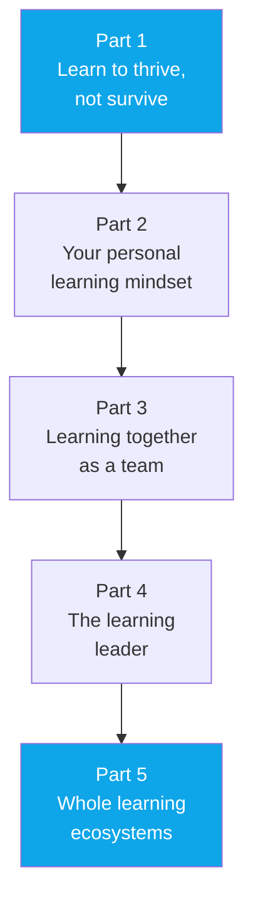

# 🧠 The Learning Mindset
### *by Katja Schipperheijn — Combining Human Competencies with Technology to Thrive*
### *Foreword by Erwin Verstraelen*

> ⏱️ **Reading time: ~16 minutes** | 🎯 **Level: Beginner-friendly, simple English** | 📚 **Covers Parts 1–5**

---

## The big idea, in one line

We live through a "perfect storm" of change — and the only real safety net is **learning to learn**, continuously, with curiosity as the engine and AI as a personal tutor, not a threat.

---

## 📑 Table of Contents

1. [Foreword — Why Now?](#fw)
2. [Part 1 — Learning to Thrive, Not Just Survive](#p1)
3. [Part 2 — Your Personal Learning Mindset](#p2)
4. [Part 3 — Learning Together](#p3)
5. [Part 4 — The Learning Leader](#p4)
6. [Part 5 — Learning Ecosystems](#p5)
7. [Cheat-Sheet](#cheat-sheet)

---

## 🌊 Foreword — Why Now?

### 🔑 Highlights (under 100 words)
We're in a "perfect storm" — geopolitics, climate, energy, food, and water crises are all converging at once, distracting us from an equally huge shift happening quietly underneath: an exponential technology revolution, sparked by large language models like ChatGPT (late 2022). Formal education has barely changed in over 100 years — one teacher, one method, many students — but LLMs open the door to a **personal digital learning buddy**: infinitely patient, always available, able to explain anything in as many ways as it takes, from childhood through adulthood.

### 📖 In Detail

The foreword's most striking idea is the concept of "**unconfuse**" — a phrase borrowed from Bill Gates, describing the moment confusion turns into understanding. The author argues that curiosity — the drive to ask "why?" without embarrassment — is the true engine of learning, and that a patient AI tutor can finally make that kind of endless questioning possible for everyone, not just students lucky enough to have a patient human teacher or tutor on hand.

A concrete real example given: **Khan Academy's KhanMigo**, an AI learning companion built for their 140-million-user platform, designed to guide students through problems the way a good tutor would — pointing out exactly where a student went wrong in an exercise, rather than just marking it "incorrect."

**🌍 Real-world scenario:** A teenager is stuck on a calculus problem and feels too embarrassed to keep asking her teacher "why" in front of the class. With a private AI learning buddy, she can ask "why" as many times as she needs, get the concept explained a completely different way each time, and only return to class once she's genuinely confident — removing the social cost of confusion entirely.

---

## 📘 Part 1 — Learning to Thrive, Not Just Survive

### 🔑 Highlights (under 100 words)
This part lays the scientific groundwork, drawing on both neuroscience (the human brain) and computer science (the artificial "brain") to explain what learning actually is — and what it is *not*. The core message: you no longer have any excuse not to embrace learning, because the barriers that used to stop people (rigid classrooms, one-size-fits-all pacing, fear of asking "silly" questions) are dissolving.

### 📖 In Detail

Traditional education assumes one method suits everyone: a teacher stands in front of a room and delivers the same lesson at the same pace to every student, regardless of how differently each person's brain processes information. The book argues this is fundamentally mismatched with how humans actually learn — some need visuals, some need to talk it through, some need to fail and retry repeatedly. When students who process information differently keep falling behind despite more and more remedial support being poured in, the problem isn't the students — it's the one-size-fits-all format itself.

**🌍 Real-world scenario:** Two students struggle with the same algebra topic. One learns best by seeing a graph and manipulating it visually; the other needs to talk through the logic step-by-step out loud. In a traditional classroom, only one teaching style is on offer, so one of them will always be underserved. A personalised, adaptive approach — whether from a skilled tutor or an AI system — can present the *same* concept in both ways, letting each student's brain meet the material on its own terms.

---

## 📗 Part 2 — Adopt a Positive Personal Learning Mindset

### 🔑 Highlights (under 100 words)
This part is about *unlearning* old baggage: the labels and emotional scars many of us picked up in school (being called "slow" at maths, "bad" at languages) that quietly shut down our willingness to try again as adults. Instead of a school-based, exam-driven mindset, the book pushes readers to embrace learning as a lifelong tool for career resilience and personal wellbeing — powered by human competencies rather than fixed labels from the past.

### 📖 In Detail

Many adults carry a small, quiet voice from childhood: "I was never good at maths," or "I'm not a science person." This part argues these labels were often assigned based on how well a child's learning style matched *one particular teacher's method* at *one particular moment* — not a fixed, permanent truth about that person's ability. Letting go of these old labels is presented as a genuine act of self-liberation, freeing adults to pick up entirely new skills at any career stage without the shadow of a childhood grade holding them back.

**🌍 Real-world scenario:** A 45-year-old marketing manager was told in school she "wasn't a numbers person" and has avoided anything data-related for her whole career. Her company now needs everyone to use basic data analytics tools. By consciously separating "a teacher once said this" from "this is permanently true about me," she approaches the new training with curiosity instead of dread — and discovers, to her own surprise, that she's actually quite good at it once it's taught in a way that clicks for her.

---

## 📙 Part 3 — Learning Together to Spark the Learning Mindset

### 🔑 Highlights (under 100 words)
Learning multiplies when done with others — this part explains the "ripple effect" of shared learning. It encourages readers to become **learning influencers** themselves: people who model curiosity and openly share what they're figuring out, encouraging others to do the same. Even within team learning, the individual still matters — so understanding what drives *social* and *lean* learning (learning efficiently, without waste) within a group is essential.

### 📖 In Detail

A "learning influencer" isn't necessarily the most senior or most expert person in the room — it's whoever is willing to say "I don't fully understand this yet, let's figure it out together" out loud, in front of others. That small act of vulnerability gives everyone else permission to admit the same thing, and a team that can openly admit confusion learns dramatically faster than one where everyone quietly pretends to already know.

**🌍 Real-world scenario:** A software team adopts a new programming framework. Instead of everyone privately struggling and pretending to keep up in meetings, the most senior engineer openly says in the team chat, "I'm stuck on this part, has anyone figured it out?" This single act shifts the whole team's culture — junior developers start asking questions too, and the team collectively becomes fluent in the new framework twice as fast as if everyone had learned in isolated silence.

---

## 📕 Part 4 — The Learning Leader Amplifies the Mindset

### 🔑 Highlights (under 100 words)
Once you're a confident learning influencer yourself, the next step is inspiring an entire team as a **learning leader**. This means actively embracing (neuro)diversity within the team — recognising that different brains process and learn differently is a strength, not a complication — and deliberately creating challenges that turn obstacles into opportunities for innovation and continuous improvement, rather than simply avoiding difficulty.

### 📖 In Detail

A learning leader's job shifts from "make sure everyone gets the right answer" to "make sure everyone feels safe enough to be wrong on the way to the right answer." Neurodiversity — the recognition that people's brains genuinely process, focus, and problem-solve in different ways — is framed here as a competitive advantage for a team, not a challenge to be managed around: a neurodiverse team, given the freedom to work in the way that suits each person, often finds solutions a uniform team would miss entirely.

**🌍 Real-world scenario:** A product team is stuck on a stubborn user-experience problem. Instead of assigning it to the "best" designer and hoping for the best, the team lead deliberately builds a small mixed group — someone who thinks in rigid step-by-step logic, someone who thinks visually and associatively, and someone who's naturally skeptical and asks "but why do we assume that?" The friction between these different thinking styles is exactly what surfaces the blind spot the team had been missing for weeks.

---

## 📔 Part 5 — Learning Ecosystems Where the Mindset Thrives

### 🔑 Highlights (under 100 words)
The final part scales everything up: learning leaders who want to go further don't just inspire their own team, they challenge their whole organisation's status quo. This means betting on people-centred innovation, accelerating "lean" learning across the wider ecosystem, and refusing to let the boundaries of one department or company limit the ripple effect — instead looking for sustainable solutions that benefit people far beyond the organisation's own walls.

### 📖 In Detail

The book's final vision is a kind of learning "ecosystem" — much like a healthy natural ecosystem where different species support each other, a learning ecosystem has schools, companies, communities and technology all reinforcing one another's growth, rather than each operating in an isolated bubble. A single company embracing continuous, personalised learning internally is good; a company that also shares what it learns with its industry, its suppliers, and its community creates something far more durable and valuable.

**🌍 Real-world scenario:** A manufacturing company builds an internal AI-assisted training academy to upskill its own factory workers on new machinery. Rather than keeping this training purely internal, it partners with the local technical college to offer the same course publicly — building a pipeline of skilled future employees for the whole region, not just cheaper training for itself. The ripple effect strengthens the entire local economy the company depends on.

---

## 🧭 Cheat-Sheet

| Concept | In one line |
|---|---|
| **Unconfuse** | The satisfying moment confusion turns into real understanding |
| **Learning mindset** | Treating learning as a lifelong, curiosity-driven pursuit, not a school-era chore |
| **Digital learning buddy** | An always-patient AI tutor that explains things as many ways as it takes |
| **Learning influencer** | Someone who models curiosity and admits confusion openly, giving others permission to do the same |
| **Learning leader** | Someone who builds psychological safety for a team to learn, fail, and improve together |
| **Learning ecosystem** | An organisation's learning culture extended out to benefit its whole community |

### ✅ Key Takeaways
- Curiosity — not discipline — is the real fuel behind lasting learning.
- Old school labels ("I'm not good at X") are not permanent facts; they're leftover context from one teacher, one method, one moment.
- Teams that admit confusion openly learn faster than teams that hide it.
- Neurodiversity in a team is a genuine problem-solving advantage, not an obstacle.
- The biggest impact comes from sharing what you learn beyond your own walls.

---

*This summary is based on the foreword and detailed five-part introduction of "The Learning Mindset" by Katja Schipperheijn.*