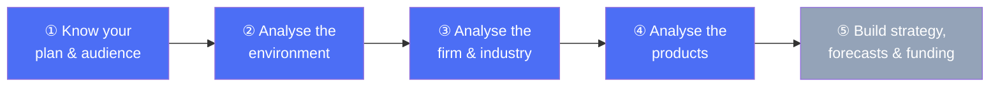
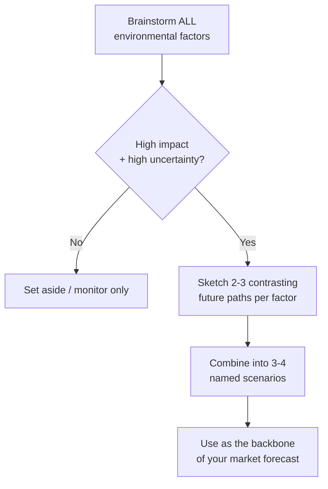
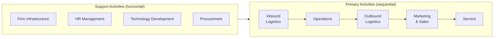
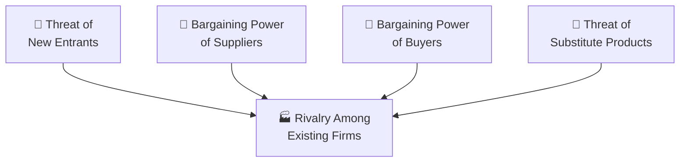

# 📊 Guide to Business Planning
### *by Graham Friend & Stefan Zehle — The Economist Guide*

> ⏱️ **Reading time: ~28 minutes** | 🎯 **Level: Beginner-to-intermediate, simple English** | 📚 **Covers Chapters 1–8**

---

## Why this book, in one line

A business plan is a **story about the future of your business**, and this book teaches you how to research, analyse and write that story so that bankers, investors, or your own boss believe it — and so you actually believe it too.

## What you'll get from this summary



This 137-page excerpt covers the first **8 chapters** — the "thinking and analysing" half of business planning (chapters 9 onward, on forecasting math and financial statements, aren't part of this excerpt).

---

## 📑 Table of Contents

1. [Introduction — Why Plan?](#chapter-1)
2. [The Business Plan — What Goes In It](#chapter-2)
3. [The Business Planning Process](#chapter-3)
4. [Strategic Planning](#chapter-4)
5. [Analysing the Environment (PEST)](#chapter-5)
6. [Analysing the Firm (VRIO, Value Chain)](#chapter-6)
7. [Industry & Competitor Analysis (Porter's 5 Forces)](#chapter-7)
8. [Product & Portfolio Analysis (BCG Matrix)](#chapter-8)
9. [Your Cheat-Sheet & Action Checklist](#cheat-sheet)

---

<a id="chapter-1"></a>
## 📘 Chapter 1 — Introduction

### 🔑 Highlights (in under 100 words)
Every serious business idea needs a business plan — not just to raise money, but because the *process* of planning forces clear thinking. A plan explains your vision, your strategy, and your numbers, and different readers (bankers, investors, your own management) read it for different reasons. This book gives you a repeatable, step-by-step process: analyse the environment → analyse the industry and firm → set strategy → forecast → arrange funding → manage risk → present and implement. It comes with a companion Excel financial model so you don't have to build one from scratch.

### 📖 In Detail

Think of a business plan as two things bolted together: a **story** (why this business will win) and a **spreadsheet** (proof that the story adds up financially). Most first-time founders focus only on the spreadsheet. This book insists the *process* of getting there — researching your market, sizing up competitors, being honest about your weaknesses — is actually more valuable than the final document, because markets shift and the plan itself may be out of date within months. The insight you gained while building it, however, stays with you.

**🌍 Real-world scenario:** Imagine you want to open a chain of organic lunch cafés. A bank manager reading your plan cares about one thing: will you generate enough cash to repay the loan, and what collateral exists if you don't? A venture capital investor reading the *same* plan asks a completely different question: how big could this get, and how do I cash out in five years with a large profit? A well-built plan has to satisfy both readers — which is why the book stresses knowing your audience before you write a single page.

**Quick reference — the toolkit this book will hand you chapter by chapter:**

| Technique | What it's for | Chapter |
|---|---|---|
| PEST analysis | Spot outside forces (political, economic, social, tech) | 5 |
| Porter's 5 Forces | Understand your industry's competitive intensity | 7 |
| VRIO analysis | Test whether a resource truly gives you an edge | 6 |
| Value chain analysis | Find where you add — or waste — value | 6 |
| SWOT analysis | Summarise strengths, weaknesses, opportunities, threats | 9 |
| Growth-share (BCG) matrix | Decide which products to fund, hold, or kill | 8 |
| Scenario planning | Prepare for an uncertain future, not just one forecast | 5 |

---

<a id="chapter-2"></a>
## 📗 Chapter 2 — The Business Plan

### 🔑 Highlights (in under 100 words)
A good business plan "tells a coherent, customer-focused story" — it isn't a data dump. Every plan should define the market, prove the numbers are credible, explain your competitive edge, name the risks, and clearly state how much money you want and what you'll do with it. Different readers — bankers, equity investors, senior management — scrutinise different things, so know your audience. The chapter also gives a full **business plan template** and practical formatting advice: short sentences, clear headings, 10–12pt font, and a 2–3 page executive summary that can stand on its own.

### 📖 In Detail

The most important sentence in this chapter is simple: *"If the strategy of the business cannot be clearly and convincingly described on paper, the chances of its working in practice are slim."* Writing forces rigor. If you can't explain in one paragraph why customers will pay you, that's a warning sign, not a writing problem.

The book gives a genuinely useful **checklist** for what makes a plan good:
- Tells a coherent, customer-focused story
- Clearly defines market, customers, suppliers, competitors
- Uses credible assumptions and forecasts
- Explains sustainable competitive advantage
- Names the biggest risks and how you'll manage them
- Has buy-in from the people who must implement it
- States exactly how much funding is needed and what return investors get

It also explains that **bankers** and **equity investors** read completely differently:

| | Bankers (debt) | Investors (equity) |
|---|---|---|
| Main worry | Will you repay principal + interest? | Will this business's value grow a lot? |
| Looks closely at | Balance sheet strength, gearing (debt/equity ratio) | Growth prospects, management quality, exit route |
| Wants to know | Is there collateral if it fails? | What's my return on equity, and how do I cash out? |

**🌍 Real-world scenario (straight from the book):** "Mobile Business" operates mobile phone networks in a fictional country, "Ruritania." Its business plan opens with: launched 1999, grew to be the #2 operator by 2003, 23% compound annual revenue growth, €600m revenue and €180m operating profit last year, 38% market share, and named core competencies of network engineering and customer billing. Notice how concrete and numeric this is — no vague claims, just facts a reader can verify and trust.

---

<a id="chapter-3"></a>
## 📙 Chapter 3 — The Business Planning Process

### 🔑 Highlights (in under 100 words)
Planning is hard to prioritise because it's *important but rarely urgent* — using Stephen Covey's famous time-management matrix, most struggling businesses live in the "urgent and important" firefighting box, when they should be investing time in the "important, not urgent" planning box. The planning process itself should be continuous and flexible: strategic review → marketing plan → operational plan → financial model → funding → risk analysis → present and approve. One person should own the whole plan even if many people contribute sections, and version control (clear file names, dated drafts) prevents costly confusion.

### 📖 In Detail

Covey's matrix divides all activities into four boxes:

```mermaid
quadrantChart
    title Where does your time actually go?
    x-axis Not Urgent --> Urgent
    y-axis Not Important --> Important
    quadrant-1 Firefighting (crises)
    quadrant-2 Distractions
    quadrant-3 Time-wasters
    quadrant-4 Planning (the goal)
    Crisis handling: [0.85, 0.85]
    Interruptions: [0.8, 0.25]
    Business planning: [0.2, 0.8]
    Busywork: [0.2, 0.2]
```

Businesses stuck constantly reacting to crises (top-right box) rarely hit even their short-term goals. The fix is deliberately protecting time for planning (top-left box) — at first by cutting out low-value activities (bottom boxes) to free up the hours.

**🌍 Real-world scenario:** A small retail chain's manager never sits down to plan because she's always "putting out fires" — a broken till, a late delivery, an angry customer. Every week feels productive but the business drifts. The book's advice: block two hours every Friday, no exceptions, purely for reviewing what's changing in the market and what needs to shift in strategy. Within a few months, those two hours start *reducing* the number of weekly fires, because problems get anticipated instead of just reacted to.

The chapter also stresses **project management** basics for bigger plans: agree deadlines with each contributor, expect sections to be interdependent (marketing numbers feed the financial model, which feeds the funding ask), and budget real time for merging everyone's writing into one consistent voice.

---

<a id="chapter-4"></a>
## 📕 Chapter 4 — Strategic Planning

### 🔑 Highlights (in under 100 words)
Strategic planning sets a 3–5 year (sometimes 10-year) direction by matching your resources to opportunities. It starts with a **stakeholder analysis** (who can help or hurt you, and what do they want), then defines **vision** (what business are we in, and where are we going), **mission** (how we'll get there) and **SMART objectives** (Specific, Measurable, Achievable, Relevant, Time-bound). Good strategy must be feasible, sustainable, adaptable, and value-adding for stakeholders — and if raising outside money, it must include a believable **exit strategy** for investors (trade sale or stock market listing).

### 📖 In Detail

**Stakeholder analysis** comes first because every business sits inside a web of competing interests:

| Stakeholder | What they want | Their leverage |
|---|---|---|
| Shareholders | Share price growth, dividends | Appoint the board |
| Lenders | Interest & principal repaid | Can enforce loan covenants |
| Staff/unions | Pay, job security, satisfaction | Strikes, turnover, customer experience |
| Suppliers | Long-term orders, being paid on time | Pricing, quality of goods supplied |
| Customers | Reliable goods/services at fair price | Where the revenue comes from |
| Government | Legal compliance, tax, jobs | Regulation, subsidies, taxation |

Once you know who you're serving, the book walks through **vision → mission → objectives**, using a lovely simple example: an organic-lunch caterer.

- **Vision:** *"To become the leading provider of organic lunches to office workers in Boomtown."*
- **Mission:** *Build a distribution system for rapid order fulfilment, using only the freshest ingredients, marketed by "taking the city block by block."*
- **SMART objectives:** Source 95% organic ingredients within 6 months; deliver 800 meals/day in year 1, rising to 1,500 by year 3; average sale value of at least $8; hit a target profit margin; and even a *soft* goal — customers and staff should feel "empathy" with the business (measured indirectly via staff turnover or a customer survey).

This shows something important: **not every objective has to be a number**, but even soft goals need some way to be tracked, or they become empty slogans.

**🌍 Real-world scenario:** A biotech start-up develops a promising new drug compound. Its strategic plan doesn't wait until the drug is on pharmacy shelves to plan an exit — it explicitly states that the moment the patent is secured, the most likely and most profitable outcome is a trade sale to a larger pharmaceutical company, rather than the years-long, expensive route of building manufacturing and sales teams from scratch. Investors reading this plan know exactly how and when they'll get their money back — which makes them far more willing to fund it in the first place.

---

<a id="chapter-5"></a>
## 📔 Chapter 5 — Analysing the Environment

### 🔑 Highlights (in under 100 words)
No business operates in a vacuum. **PEST analysis** (Political, Economic, Social, Technological — sometimes PESTEL, adding Environmental and Legal) is a structured brainstorm of outside forces that could help or hurt you. Markets move at different speeds — **stable** (food processing), **dynamic** (a newly deregulated industry), or **turbulent** (new tech sectors with constant disruption) — and your planning style should match. Because forecasting a turbulent market from past data is unreliable, the chapter pairs PEST with **scenario planning**: build 3–4 vivid, named "stories" of how the future could unfold, rather than a single best-guess forecast.

### 📖 In Detail

**PEST factors to brainstorm, with real examples from the book:**

- **Political:** tax policy, interest-rate policy, trade rules (e.g., China joining the WTO opened its huge market to exporters), industry regulation
- **Economic:** the business cycle, inflation, credit availability (the 2007–08 credit crunch made borrowing far harder and pricier), commodity prices
- **Social:** population growth, an ageing population in developed countries, rural-to-urban migration, changing attitudes to risk and work
- **Technological:** competitors' R&D spend, how fast new tech is adopted, whether new tech opens brand-new markets

The book runs a full worked example on **mobile broadband** — and it's a great mini case study in how the four categories interact: privacy laws around location data (political) collide with falling laptop costs (economic) and rising demand for on-the-go video (social) and better battery life (technological) to produce one plausible future scenario the authors nickname **"Convergence is King"** — where customers stop caring whether they're watching a video on their laptop, TV, or phone; it all just works everywhere.

**The 4-step scenario-planning method:**
1. Identify the factors with the **highest uncertainty and highest impact**
2. Sketch 2–3 realistic, *contrasting* futures for each factor
3. Combine them into just 3–4 coherent overall scenarios (don't overcomplicate it)
4. Write a vivid, named narrative for each ("Convergence is King" beats "Scenario B")



**🌍 Real-world scenario:** A regional airline is planning five years ahead. Fuel costs (economic), new carbon-emission rules (political), a generational shift toward "flight-shaming" and rail travel (social), and battery-electric short-haul aircraft nearing commercial viability (technological) are all highly uncertain *and* hugely important to the airline's future. Rather than build one forecast, the airline's planners write two named scenarios — "Green Skies," where electric short-haul planes and carbon taxes reshape the market by year four, and "Business as Usual," where adoption is slower than hyped — and stress-test their fleet and route strategy against both.

---

<a id="chapter-6"></a>
## 📒 Chapter 6 — Analysing the Firm

### 🔑 Highlights (in under 100 words)
Before setting strategy, look inward: what unique resources do you have, and are they arranged well? **VRIO analysis** asks whether a resource is Valuable, Rare, hard to Imitate, and whether your Organisation actually exploits it — only resources passing all four tests give lasting advantage. **Value chain analysis** (Michael Porter's model) breaks your business into 5 primary activities (inbound logistics → operations → outbound logistics → marketing/sales → service) plus 4 support activities, showing where value — and waste — happens. A full **resource audit** then checks whether your resources are used efficiently *and* effectively.

### 📖 In Detail

**VRIO in one table:**

| Question | If "No"... | If "Yes" to all four... |
|---|---|---|
| **V**aluable — does it help cut costs, raise prices, or grow share? | Not a source of advantage at all | ✅ |
| **R**are — do rivals lack it too? | Just "competitive parity" | ✅ |
| Hard to **I**mitate — expensive/difficult to copy? | Only a *temporary* edge | ✅ |
| **O**rganisation — are you set up to actually exploit it? | Wasted potential | ✅ → **Sustainable competitive advantage** |

**Porter's value chain**, visualised:



The point of mapping this out is to catch a **strategy mismatch**. If you're competing on low cost, *every single box* needs to be geared toward cutting cost. The book's favourite example: budget airlines strip cost out of every stage — internet-only bookings (no travel-agent commission), no assigned seats, no free meals, secondary airports with cheaper landing fees. One expensive box (say, a fancy head office) undermines the whole strategy.

**🌍 Real-world scenario (from the book):** In 2003, Scottish Radio Holdings did a "spring clean" of old, forgotten assets and discovered **600 archived concert recordings** from artists like U2 and Rod Stewart sitting unused in storage. These weren't even listed on the balance sheet as an asset. A licensing deal with Universal Music turned this dusty archive into a brand-new royalty income stream — a perfect real-world example of a **resource audit** uncovering hidden value nobody had thought to exploit.

Another vivid example: a manufacturing business has an overall return of 18% on capital employed, but its in-house retail shops only return 10%. Value chain analysis reveals retailing is dragging down group performance — leading to a decision to sell the shops and redeploy the capital into the core, higher-return manufacturing business.

---

<a id="chapter-7"></a>
## 📓 Chapter 7 — Industry & Competitor Analysis

### 🔑 Highlights (in under 100 words)
Industries move through a life cycle — introduction, growth, maturity, decline — and each stage changes the balance of power between you, your buyers, suppliers, new entrants and substitute products. **Porter's Five Forces** is the classic framework for measuring how intense competition really is in your industry. You then rank named competitors against **key success factors** (KSFs), weighting and scoring each one, to see exactly where you're strong or exposed. **Benchmarking** against competitor data — even via anonymised "benchmarking clubs" — turns vague assumptions into evidence-based targets.

### 📖 In Detail

**Porter's Five Forces**, and how they shift across the industry life cycle:



| Force | Introduction | Growth | Maturity | Decline |
|---|---|---|---|---|
| New entrants | Few | Bandwagon rush | Consolidation | Firms exit |
| Buyer power | Low | Very low (seller's market) | Rising | High (buyer's market) |
| Supplier power | Medium | High | Declining | Low |
| Substitute threat | None | Low | Growing | Often *the cause* of decline |
| Rivalry | Low | Low (focus on growth) | Intense | Declining as firms leave |

A great real-world illustration of **substitutes**: when short flights compete with trains, German airline **Lufthansa** simply started *selling train tickets as flights* — on the short Cologne–Frankfurt route, passengers check in at a Lufthansa desk in the train station, get a boarding pass, and ride the train as their "flight" before connecting to a real plane. Rather than fight the substitute, they became the substitute.

For ranking competitors, the book uses **Key Success Factor (KSF) scoring**: pick up to 10 factors (market share, distribution, brand, product quality, R&D...), weight their importance (weights sum to 1), score your firm and each rival from 1–5 on each factor, multiply and sum. In the book's worked example, "Own business" scores 3.8 overall versus 3.6, 2.1, and 2.9 for three rivals — and critically, the *breakdown* shows the nearest rival is only beating "Own business" on one factor: distribution. That single insight — "fix distribution" — is worth more than the overall score itself.

**🌍 Real-world scenario:** A regional bookshop chain benchmarks itself against national chains using an industry benchmarking club (a trusted third party collects anonymised data on sales-per-outlet, staff ratios, and stock turnover from several competitors and reports back only the "best-in-class," average, and worst figures). The chain discovers its stock turnover is well below "best-in-class" — a concrete, evidence-based target to build directly into next year's plan, without ever knowing exactly which rival set that benchmark.

---

<a id="chapter-8"></a>
## 📘 Chapter 8 — Product & Portfolio Analysis

### 🔑 Highlights (in under 100 words)
If you sell more than one product, you need a way to decide where to invest, where to hold steady, and what to kill. The **experience curve** shows unit costs fall predictably as cumulative volume rises (a virtuous circle: more volume → lower cost → lower price → more market share). The **product life cycle** (introduction → growth → maturity → decline) shapes strategy at each stage. The **BCG growth-share matrix** classifies products as **Stars, Problem Children, Cash Cows or Dogs**. The more advanced **Directional Policy Matrix** adds many more real-world factors beyond just growth and market share.

### 📖 In Detail

**The BCG Growth-Share Matrix** — the single most famous tool in this book:

```mermaid
quadrantChart
    title BCG Growth-Share Matrix
    x-axis High Relative Share --> Low Relative Share
    y-axis Low Market Growth --> High Market Growth
    quadrant-1 Stars (invest to grow)
    quadrant-2 Problem Children (invest or divest?)
    quadrant-3 Cash Cows (harvest cash)
    quadrant-4 Dogs (divest or niche down)
    New product launch: [0.3, 0.85]
    Flagship product: [0.75, 0.7]
    Declining line: [0.2, 0.25]
    Mature best-seller: [0.8, 0.2]
```

- **⭐ Star** — high share, fast-growing market. Profitable, but needs continued cash to keep pace with growth. Keep investing, and it eventually becomes a Cash Cow.
- **❓ Problem Child** — fast-growing market, but low share. Needs cash just to keep up, let alone gain ground. Either invest heavily to make it a Star, or divest before it slides into becoming a Dog.
- **🐄 Cash Cow** — high share, slow/mature market. Needs little new investment; generates surplus cash that funds your Stars and Problem Children (and dividends).
- **🐕 Dog** — low share, slow market. Usually best divested — or repositioned into a small, premium niche.

The book's core advice: a healthy company has **cash cows funding new stars**, not an entire portfolio of ageing cash cows with nothing coming up behind them.

**🌍 Real-world scenario (from the book):** Cognac makers faced a mature, ageing, declining market as younger drinkers stopped choosing traditional after-dinner digestifs. Rather than accept decline, they repositioned Cognac as a trendy drink **on ice, as an aperitif** — much to older traditionalists' horror — successfully finding new occasions and a younger audience for an old product, effectively pulling a "Cash Cow" back from the edge of "Dog" territory.

For a richer picture than just two factors (share and growth), the **Directional Policy Matrix** (developed at Shell) scores dozens of factors — market size, regulatory risk, technology strength, financial position — to place products into strategy boxes like **Leader**, **Try Harder**, **Double or Quit**, **Cash Generator**, and **Divest**. It's more subjective, but forces much richer strategic thinking than two numbers alone ever could.

---

<a id="cheat-sheet"></a>
## ✅ Your Action Checklist

Use this as a working checklist as you build your own plan:

- [ ] Define who will read this plan, and what *they* specifically care about
- [ ] Draft your executive summary **first** — even before your analysis is done — as a working hypothesis
- [ ] Run a PEST analysis and build 3–4 named future scenarios
- [ ] Map your value chain and run a VRIO test on your top 3 claimed strengths
- [ ] Score your top 3 competitors on 5–10 key success factors
- [ ] Plot your products on a growth-share matrix — do you have Cash Cows funding your Stars?
- [ ] Set SMART objectives and name your funding request precisely
- [ ] Get buy-in from whoever will actually have to implement the plan

---

*This summary is based on Chapters 1–8 of "Guide to Business Planning" by Graham Friend and Stefan Zehle (The Economist Guide series). For financial forecasting, valuation, funding and risk analysis (Chapters 9 onward), refer to the full book.*