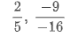
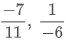

source:
- https://india.ck12.org/cbook/ck-12-cbse-maths-class-8/#

#### Positive and Negative Rational Numbers
----------
- like integers, rational numbers can be positive or negative. Every rational number except 0 is either positive or negative

- A rational number is said to be positive if its numerator and denominator are both positive or both negative. For example, 
 
  both are positive rational numbers. 

- A rational number is said to be negative if its numerator and denominator are such that, one of them is a positive integer and the other is a negative integer. 

For example, 
 
  are negative rational numbers. 

