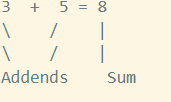
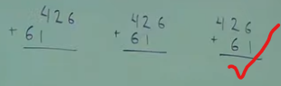

## Whole Numbers: Addition and Subtraction

source:
[Prof Leonard - Addition and subtraction of Whole Numbers. perimeter](https://www.youtube.com/watch?v=mRRnpz6udeE&list=PL4C9296DF81B9EF13&index=2)

consider a painter painted 5 houses on the right & 3 on left, so how many houses did he paint all together

so,   
here 3 & 5 are Addends and 8 is Sum (sum of addends)

### for Large numbers
-----------
426 - 61 
3rd pictures is the correct way to add numbers as they need to be in their right place values, below is the representation.

